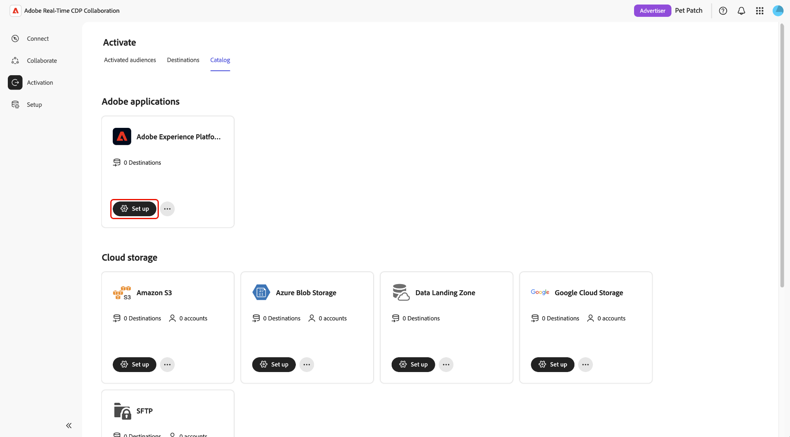

# Configurare Adobe Experience Platform come destinazione

Configura questa destinazione per attivare il pubblico dal progetto a Adobe Experience Platform. L’attivazione dei tipi di pubblico in Adobe Experience Platform consente di sfruttare le funzionalità della piattaforma per la segmentazione, l’analisi e l’attivazione dei tipi di pubblico tra vari canali di marketing. Per ulteriori informazioni su Adobe Experience Platform, consulta la [panoramica di Experience Platform](https://experienceleague.adobe.com/it/docs/experience-platform/landing/home){target="_blank"}.

Adobe Experience Platform utilizza un flusso di lavoro di configurazione specifico per la destinazione diverso dal flusso di lavoro di destinazione dell&#39;archiviazione cloud descritto in [Configurare e gestire le destinazioni dell&#39;archiviazione cloud](./manage-destinations.md).

>[!WARNING]
>
>Una volta creata, una destinazione non può essere aggiornata. Se devi modificare delle impostazioni, devi eliminare la destinazione esistente e crearne una nuova.

## Configurare la destinazione {#configure-destination}

Per configurare Adobe Experience Platform come destinazione, passare all&#39;area di lavoro **[!UICONTROL Activation]**, selezionare la scheda **[!UICONTROL Catalog]** e selezionare **[!UICONTROL Configura]** per Adobe Experience Platform.

Viene visualizzato il flusso di lavoro **[!UICONTROL Crea destinazione]**.

### Configurare la sandbox {#configure-sandbox}

>[!CONTEXTUALHELP]
>id="rtcdp_collaboration_destinations_audience_expiration"
>title="Scadenza pubblico"
>abstract="Il periodo di tempo dopo il quale il pubblico non sarà più disponibile in Adobe Experience Platform. La scadenza predefinita è di 30 giorni, ma è possibile impostarla su qualsiasi valore compreso tra 1 e 30 giorni."

Innanzitutto, devi selezionare la sandbox in cui verranno inviati i dati sul pubblico.

>[!IMPORTANT]
>
>Puoi selezionare solo una sandbox a cui l’utente ha accesso. Per impostazione predefinita, tutti gli utenti di Collaboration hanno accesso alla sandbox **Prod**. Per poter accedere ad altre sandbox, un amministratore deve aggiungere altre sandbox a un ruolo assegnato al tuo utente. Per ulteriori informazioni sulla gestione dei ruoli, fare riferimento alla guida [gestione ruoli](../permissions/manage-roles.md).

Nella sezione **[!UICONTROL Configura sandbox]**, seleziona il menu a discesa **[!UICONTROL Sandbox]** o digita il nome di una sandbox.

In alternativa, è possibile selezionare **[!UICONTROL Sfoglia sandbox]** per visualizzare tutte le sandbox disponibili e le relative **[!UICONTROL Tipo]**, **[!UICONTROL Stato]** e **[!UICONTROL Area]**. Selezionare la sandbox da utilizzare, quindi selezionare **[!UICONTROL Salva]**.

Quindi, configura **[!UICONTROL Scadenza pubblico]**. Per impostazione predefinita, la scadenza del pubblico è impostata su 30 giorni. Puoi scegliere di impostare la scadenza tra 1 e 30 giorni. Dopo la data di scadenza, il pubblico non sarà più disponibile in Adobe Experience Platform.

### Creare la mappatura di attivazione {#create-activation-mapping}

>[!CONTEXTUALHELP]
>id="rtcdp_collaboration_destinations_activation_matchkeys"
>title="Chiavi di corrispondenza dell’attivazione"
>abstract="Le chiavi di corrispondenza dell’attivazione vengono visualizzate in base a quelle selezionate al momento della creazione dell’organizzazione."

>[!CONTEXTUALHELP]
>id="rtcdp_collaboration_destinations_activation_mapping"
>title="Maggiori informazioni"
>abstract=""

>[!CONTEXTUALHELP]
>id="rtcdp_collaboration_destinations_target_namespaces"
>title="Spazi dei nomi di destinazione"
>abstract="Gli spazi dei nomi di destinazione specificano a quale spazio dei nomi di identità verrà mappata la chiave di corrispondenza in Adobe Experience Platform. Le chiavi di corrispondenza con hash devono essere mappate a uno spazio dei nomi di destinazione che supporta i valori con hash."

Per impostazione predefinita, tutte le chiavi di corrispondenza abilitate per l’account sono incluse nella mappatura di attivazione. Se non desideri mappare direttamente una chiave di corrispondenza a uno spazio dei nomi di destinazione, puoi utilizzare l’opzione della chiave collegata per sostituirla con una chiave di corrispondenza diversa. Per ulteriori informazioni sulle chiavi collegate, vedere la [sezione seguente](#linked-keys).

#### Mappare gli spazi dei nomi di destinazione {#map-target-namespaces}

Per mappare ogni chiave di corrispondenza a uno spazio dei nomi di destinazione, seleziona il campo **[!UICONTROL Spazi dei nomi di destinazione]** accanto alla chiave di corrispondenza. Viene visualizzata la finestra di dialogo **[!UICONTROL Seleziona campo di origine]**. Trovare lo spazio dei nomi di destinazione nell&#39;elenco o cercare uno spazio dei nomi specifico. Selezionare lo spazio dei nomi di destinazione da utilizzare per la chiave di corrispondenza, quindi selezionare **[!UICONTROL Seleziona]**.

>[!IMPORTANT]
>
>Le chiavi di corrispondenza con hash devono essere mappate a uno spazio dei nomi di destinazione che supporta i valori con hash. Ad esempio, la chiave di corrispondenza per l&#39;**[!UICONTROL e-mail con hash]** deve essere mappata allo spazio dei nomi dell&#39;identità **[!UICONTROL E-mail(SHA256, in minuscolo)]** in Adobe Experience Platform. Impossibile mappare la chiave di corrispondenza **[!UICONTROL Hashed e-mail]** allo spazio dei nomi dell&#39;identità **[!UICONTROL E-mail]**, poiché questo spazio dei nomi non supporta valori con hash.

Ripeti questo processo per ogni chiave di corrispondenza da includere nella mappatura di attivazione. Se non desideri includere una chiave di corrispondenza, puoi rimuoverla o utilizzare l’opzione della chiave collegata per sostituirla con una chiave di corrispondenza diversa.

#### Chiavi collegate {#linked-keys}

>[!CONTEXTUALHELP]
>id="rtcdp_collaboration_destinations_linked_key"
>title="Chiave collegata"
>abstract="Le chiavi collegate consentono di specificare che, durante l’attivazione, dovrà essere utilizzata una chiave di corrispondenza diversa da quella originale. Per poter essere attivato, un profilo deve avere valori sia per la chiave di corrispondenza originale, sia per quella collegata."

Le chiavi collegate consentono di specificare che, durante l’attivazione, dovrà essere utilizzata una chiave di corrispondenza diversa da quella originale. Per comprendere meglio il funzionamento delle chiavi collegate, considera l’esempio seguente:

Un retailer desidera inviare i dati attivati ad Experience Platform al proprio sistema di gestione delle relazioni con i clienti. Retailer ha abilitato l’IP con hash come chiave di corrispondenza per il proprio account per aumentare la percentuale di corrispondenza quando si attivano i tipi di pubblico. Tuttavia, il sistema CRM di retailer non supporta l’IP con hash come spazio dei nomi di identità, pertanto desidera utilizzare la chiave di corrispondenza dell’ID del sistema CRM invece di attivare i tipi di pubblico in Experience Platform. Retailer può utilizzare l’opzione della chiave collegata per attivare i tipi di pubblico in Experience Platform utilizzando l’ID del sistema di gestione delle relazioni con i clienti invece dell’IP con hash.

>[!NOTE]
>
>Per poter essere attivato, un profilo deve avere valori sia per la chiave di corrispondenza originale, sia per quella collegata. Ad esempio, se l’ID con hash è collegato all’ID del sistema di gestione delle relazioni con i clienti, un profilo deve avere valori sia per l’ID con hash che per l’ID del sistema di gestione delle relazioni con i clienti da attivare. Se manca uno dei due valori, il profilo non verrà attivato.

Per utilizzare una chiave collegata, attiva l&#39;opzione **[!UICONTROL Chiave collegata]** accanto alla chiave di corrispondenza che desideri utilizzare al suo posto. Viene visualizzata la sezione **[!UICONTROL Chiave collegata]** che richiede di creare la mappatura.

Selezionare la **[!UICONTROL chiave collegata]** che si desidera utilizzare dal menu a discesa. In base all&#39;esempio precedente, retailer selezionerà **[!UICONTROL ID CRM]** come chiave collegata.

Quindi, se non lo hai già fatto, specifica lo spazio dei nomi di destinazione per la chiave collegata. Se hai già selezionato lo spazio dei nomi di destinazione per la chiave di corrispondenza nella sezione **[!UICONTROL Crea mapping di attivazione]**, verrà popolato automaticamente. Se non hai ancora selezionato uno spazio dei nomi di destinazione per la chiave collegata, puoi farlo ora.

Seleziona il campo **[!UICONTROL Spazi dei nomi di destinazione]** accanto alla chiave collegata. Viene visualizzata la finestra di dialogo **[!UICONTROL Seleziona campo di origine]**. Trovare lo spazio dei nomi di destinazione nell&#39;elenco o cercare uno spazio dei nomi specifico. Selezionare lo spazio dei nomi di destinazione da utilizzare per la chiave collegata, quindi selezionare **[!UICONTROL Seleziona]**.

La chiave collegata è ora configurata.

>[!NOTE]
>
>È possibile utilizzare un solo spazio dei nomi di destinazione chiave collegato per ogni mappatura di attivazione. Ad esempio, se colleghi l’ID con hash all’ID del sistema di gestione delle relazioni con i clienti, l’attivazione dell’opzione della chiave collegata per un altro campo lo collegherà anche all’ID del sistema di gestione delle relazioni con i clienti.

Una volta completata la mappatura di tutte le chiavi di corrispondenza, controlla le impostazioni. La sezione **[!UICONTROL Anteprima]** fornisce un riepilogo della configurazione.

>[!IMPORTANT]
>
>Attualmente, ogni chiave di corrispondenza si attiva ad Experience Platform come pubblico separato. Ad esempio, se hai [!UICONTROL e-mail con hash] e [!UICONTROL telefono con hash] come chiavi di corrispondenza, verranno creati due tipi di pubblico separati in Audience Portal quando viene attivato un pubblico.

Quando sei soddisfatto della tua configurazione, seleziona **[!UICONTROL Crea destinazione]**. Viene visualizzato un messaggio di conferma che indica che la destinazione è stata creata correttamente.

## Utilizzo di Adobe Experience Platform come destinazione

Dopo aver configurato Experience Platform come destinazione, puoi iniziare a [attivare i tipi di pubblico](../collaborate/activate.md) nella piattaforma tramite i tuoi progetti. Attualmente, il processo di attivazione è un processo in un unico passaggio avviato dal collaboratore. Ad esempio, quando un inserzionista attiva un pubblico, questo viene inviato alla destinazione preconfigurata dell’editore (Experience Platform). L’editore non deve effettuare alcuna operazione aggiuntiva per inviare il pubblico alla destinazione. Lo stesso vale per il modello di collaborazione brand-to-brand.

>[!IMPORTANT]
>
>**devi** configurare Experience Platform come destinazione *prima* che il tuo collaboratore attivi un pubblico. Se la destinazione non è configurata, il pubblico verrà inviato all&#39;utente e sarà visibile nella scheda **[!UICONTROL Attiva]** a livello di progetto, ma non sarà attivato in Experience Platform.

Dopo l&#39;attivazione, il pubblico sarà disponibile in [Audience Portal](#audience-portal) in Experience Platform con Real-Time CDP Collaboration come origine. Questi tipi di pubblico possono quindi essere utilizzati nelle campagne e nel coinvolgimento dei clienti.

### Audience Portal {#audience-portal}

Dopo aver configurato Adobe Experience Platform come destinazione, puoi visualizzare i tipi di pubblico attivati nel Portale pubblico. Audience Portal è un hub centrale all’interno di Adobe Experience Platform che consente di visualizzare e gestire i tipi di pubblico. Audience Portal ora fornisce Real-Time CDP Collaboration come origine per filtrare i tipi di pubblico.

>[!IMPORTANT]
>
>È tua responsabilità applicare tutte le etichette di utilizzo dei dati necessarie ai tipi di pubblico attivati in Adobe Experience Platform. Per ulteriori informazioni, consulta la guida [etichette di utilizzo dei dati](https://experienceleague.adobe.com/it/docs/experience-platform/data-governance/labels/overview){target="_blank"}.

Per ulteriori informazioni su Audience Portal, consulta la guida [Panoramica di Audience Portal](https://experienceleague.adobe.com/en/docs/experience-platform/segmentation/ui/audience-portal#manage-audiences){target="_blank"}.
