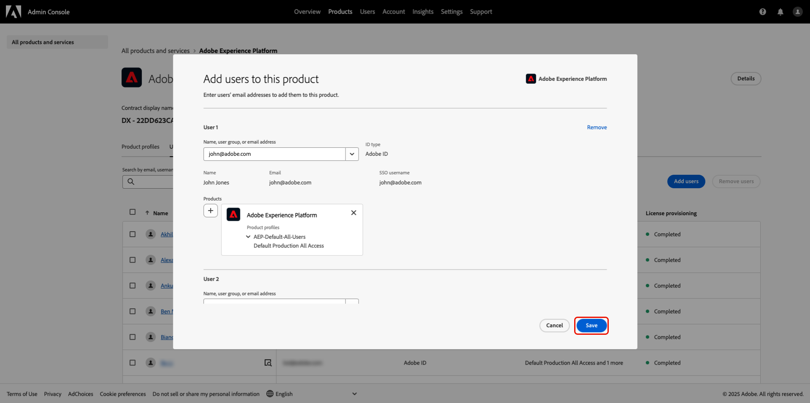
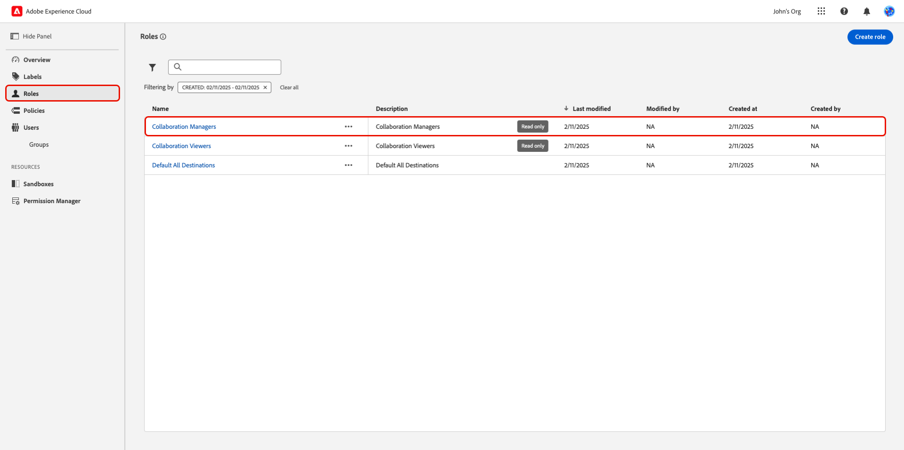

# Gestire l’accesso degli utenti tramite autorizzazioni {#manage-user-access}

{{limited-availability-release-note}}

Gestisci le autorizzazioni e l&#39;accesso degli utenti ai singoli componenti all&#39;interno di Real-Time CDP Collaboration tramite l&#39;interfaccia di Experience Cloud [Autorizzazioni](https://experienceleague.adobe.com/en/docs/experience-platform/access-control/abac/permissions-ui/browse){target="_blank"}. Le autorizzazioni consentono agli amministratori di sistema e di prodotto di definire [ruoli](./manage-roles.md) per gestire l&#39;accesso degli utenti a funzioni e risorse specifiche.

## Configurare l’accesso alle autorizzazioni {#permissions-access}

Per accedere alle autorizzazioni, devi disporre dell’accesso amministratore e utente al prodotto Adobe Experience Platform. Per configurare i privilegi di amministratore di prodotto è necessario un amministratore di sistema, mentre i privilegi utente possono essere configurati da un amministratore di sistema o di prodotto. Per ulteriori informazioni sui ruoli amministrativi, leggere la [guida al controllo degli accessi](./overview.md#hierarchy).

>[!TIP]
>
>In questa guida, un **amministratore** farà riferimento a **amministratori di sistema e di prodotto**.

### Amministratori di sistema: configurare l’accesso come amministratore del prodotto {#admin-access}

Concedi a un amministratore di prodotto utente l’accesso per fornire funzionalità amministrative all’interno del prodotto Experience Platform tramite i seguenti passaggi:

>[!IMPORTANT]
>
>In qualità di amministratore di sistema, hai accesso predefinito a prodotti Experience Cloud specifici, come Adobe Admin Console. Tuttavia, per utilizzare le Autorizzazioni, è necessario fornire a se stessi l’accesso al prodotto Experience Platform all’amministratore del prodotto e all’utente. Segui la guida dettagliata seguente per accedere a come amministratore di sistema.

Accedi a [Adobe Experience Cloud](https://experience.adobe.com/){target="_blank"} con le tue credenziali. Viene visualizzata la visualizzazione Home con un elenco dei prodotti disponibili nella sezione **[!UICONTROL Accesso rapido]**. Seleziona **[!UICONTROL Admin Console]**.

{zoomable="yes"}

Viene visualizzato il dashboard della panoramica di [Adobe Admin Console](https://adminconsole.adobe.com/). Selezionare **[!UICONTROL Adobe Experience Platform]** dall&#39;elenco **[!UICONTROL Prodotti]** in **[!UICONTROL Prodotti e servizi]**.

{zoomable="yes"}

Viene visualizzato il dashboard di Adobe Experience Platform. Selezionare la scheda **[!UICONTROL Amministratori]**, quindi selezionare **[!UICONTROL Aggiungi amministratore]**.

{zoomable="yes"}

Viene visualizzata la finestra di dialogo **[!UICONTROL Aggiungi amministratori di prodotto]**. Immettere l&#39;indirizzo e-mail o il nome utente nel campo di testo **[!UICONTROL Indirizzo e-mail o nome utente]**, quindi selezionare l&#39;account corretto dal menu a discesa. Seleziona **[!UICONTROL Salva]** per completare l&#39;aggiunta dell&#39;utente come amministratore di prodotto.

{zoomable="yes"}

L’utente ora dispone dei privilegi di amministratore del prodotto e può eseguire funzioni amministrative, ad esempio aggiungere utenti o altri amministratori al prodotto all’interno di Admin Console. Successivamente, avrà bisogno dell’accesso dell’utente al prodotto Experience Platform per accedere ed eseguire funzioni all’interno di Autorizzazioni.

### Amministratori: configurare l’accesso utente ad Experience Platform {#user-access}

Ora che hai concesso l’accesso come amministratore del prodotto, devi fornire agli utenti l’accesso al prodotto Experience Platform. Come parte delle configurazioni di accesso, assegnerai all&#39;utente [profili di prodotto](https://helpx.adobe.com/it/enterprise/using/manage-product-profiles.html) specifici.

>[!TIP]
>
>Se segui quanto descritto nella sezione precedente, dovrai già trovarti all’interno del prodotto Adobe Experience Platform e potresti saltare il primo passaggio.

Passa a [Admin Console](https://adminconsole.adobe.com/){target="_blank"} e seleziona **[!UICONTROL Adobe Experience Platform]** dall&#39;elenco **[!UICONTROL Prodotti]** in **[!UICONTROL Prodotti e servizi]**.

{zoomable="yes"}

Selezionare la scheda **[!UICONTROL Utenti]**, quindi selezionare **[!UICONTROL Aggiungi utenti]**.

{zoomable="yes"}

Viene visualizzata la finestra di dialogo **[!UICONTROL Aggiungi utenti al prodotto]**. Immettere il nome o l&#39;indirizzo di posta elettronica dell&#39;utente nel campo di testo **[!UICONTROL Nome, gruppo di utenti o indirizzo di posta elettronica]**, quindi selezionare l&#39;account corretto dal menu a discesa. Quindi, seleziona l&#39;opzione di aggiunta **[!UICONTROL Prodotti]**.

{zoomable="yes"}

Viene visualizzata la finestra di dialogo **[!UICONTROL Seleziona profili di prodotto]**. Selezionare **[!UICONTROL AEP-Default-All-Users]** e **[!UICONTROL Default Production All Access]**, quindi selezionare **[!UICONTROL Apply]**.

{zoomable="yes"}

Verificare che le informazioni siano corrette, quindi selezionare **[!UICONTROL Salva]**.

{zoomable="yes"}

Ora l’utente deve disporre dell’accesso amministratore di prodotto e prodotto ad Experience Platform, per poter accedere alle Autorizzazioni. Successivamente, devi assegnare all’utente due ruoli fondamentali per consentirgli di accedere all’interfaccia utente di Experience Platform.

### Amministratori: configurare l’accesso all’interfaccia utente di Experience Platform {#product-access}

In Real-Time CDP Collaboration, gli amministratori e gli utenti finali lavoreranno con i dati provenienti da Experience Platform, ad esempio i tipi di pubblico e i registri di audit. Questi dati vengono conservati all’interno di istanze di Experience Platform denominate sandbox. Per garantire che gli utenti possano interagire con questi dati, devi assegnare [ruoli predefiniti](https://experienceleague.adobe.com/en/docs/experience-platform/access-control/home#default-roles){target="_blank"} all&#39;utente.

Per iniziare, passa a [Adobe Experience Cloud](https://experience.adobe.com/). Dovresti trovare **[!UICONTROL Experience Platform]** e **[!UICONTROL Autorizzazioni]** all&#39;interno di **[!UICONTROL Accesso rapido]**.

{zoomable="yes"}

>[!NOTE]
>
> L’accesso ai prodotti può richiedere alcuni minuti e riceverai un’e-mail di avviso per informarti che hai ricevuto l’accesso. Se dopo aver ricevuto l’e-mail non trovi Experience Platform o le Autorizzazioni in Adobe Experience Cloud, disconnettiti e accedi di nuovo al tuo account.

In questa fase, è ora possibile accedere a **[!UICONTROL Autorizzazioni]**. Se tenti di accedere a **[!UICONTROL Experience Platform]**, riceverai un avviso che informa che non sono abilitate sandbox, come mostrato di seguito. Per risolvere questo problema, devi assegnare i ruoli predefiniti al tuo utente. Per iniziare, seleziona **[!UICONTROL Autorizzazioni]**.

{zoomable="yes"}

Verrà visualizzato il dashboard **[!UICONTROL Autorizzazioni]**. Seleziona **Utenti** dal pannello a sinistra, quindi seleziona il nome dell&#39;utente.

{zoomable="yes"}

Selezionare la scheda **[!UICONTROL Ruoli]**, quindi selezionare **[!UICONTROL Aggiungi ruoli]**.

{zoomable="yes"}

Viene visualizzata la finestra di dialogo **[!UICONTROL Aggiungi ruoli]**. Seleziona **[!UICONTROL Accesso predefinito a tutti i processi di produzione]** e **[!UICONTROL Amministratori sandbox]**, quindi seleziona **[!UICONTROL Salva]**.

{zoomable="yes"}

Ora puoi accedere ad Experience Platform e alle Autorizzazioni. Nel passaggio finale, concederai l’accesso a Real-Time CDP Collaboration.

### Amministratori: configurare l’accesso a Real-Time CDP Collaboration {#RTCDP-collaboration-access}

Per concedere agli utenti l’accesso a Real-Time CDP Collaboration, utilizza un concetto di controllo degli accessi denominato ruoli. I ruoli definiscono il livello di accesso di un amministratore o un utente alle [risorse](https://experienceleague.adobe.com/en/docs/experience-platform/access-control/home#permissions) della tua organizzazione.

Quando configuri l’accesso individuale a Real-Time CDP Collaboration, assegni i ruoli degli utenti contenenti le autorizzazioni dalla risorsa Collaborazioni. Puoi usare la guida [gestione ruoli](./manage-roles.md) per ottenere informazioni su:

- i [due ruoli standard](./manage-roles.md#standard-roles) e i livelli di accesso concessi a Real-Time CDP Collaboration
- creazione di [ruoli personalizzati](./manage-roles.md#specific-access-roles) tramite la risorsa Collaboration
- l&#39;elenco delle autorizzazioni incluse nella risorsa Collaborazioni

>[!NOTE]
>
>Inoltre, un utente deve essere assegnato a un ruolo contenente l&#39;autorizzazione **[!UICONTROL Prod]** nelle risorse **[!UICONTROL Sandbox]**. Entrambi i ruoli standard contengono questa autorizzazione. Se si sceglie di assegnare a un utente un ruolo personalizzato anziché un ruolo standard, è necessario assicurarsi che uno dei ruoli assegnati contenga questa autorizzazione.

Dopo aver scelto o creato un ruolo che include il livello di accesso necessario per l&#39;utente, è necessario assegnare l&#39;utente a tale ruolo.

#### Assegna un ruolo

È possibile assegnare più ruoli a un singolo utente o più utenti a un singolo ruolo. Il primo caso è stato trattato in precedenza quando [sono stati assegnati i ruoli predefiniti](#product-access) per concedere a un utente l&#39;accesso ad Experience Platform. Nei passaggi successivi, gli utenti verranno assegnati direttamente al ruolo selezionato.

In **[!UICONTROL Autorizzazioni]** seleziona **[!UICONTROL Ruoli]** dal pannello a sinistra, quindi seleziona il tuo ruolo dall&#39;elenco.

{zoomable="yes"}

Viene visualizzata la pagina dei dettagli del ruolo. Selezionare la scheda **[!UICONTROL Utenti]**, quindi selezionare **[!UICONTROL Aggiungi utenti]**.

{zoomable="yes"}

Viene visualizzata la finestra di dialogo **[!UICONTROL Aggiungi utenti]**. Seleziona gli utenti dall&#39;elenco, quindi seleziona **[!UICONTROL Salva]**.

{zoomable="yes"}

L&#39;utente dovrebbe ora vedere **[!UICONTROL RTCDP Collaboration]** elencato come prodotto in **[!UICONTROL Accesso rapido]** in Experience Cloud.

## Passaggi successivi

Ora che gli utenti hanno accesso a Real-Time CDP Collaboration, possono iniziare a utilizzare il prodotto. Per ulteriori informazioni sul prodotto nel suo complesso, consulta la [guida alla panoramica](../home.md).
