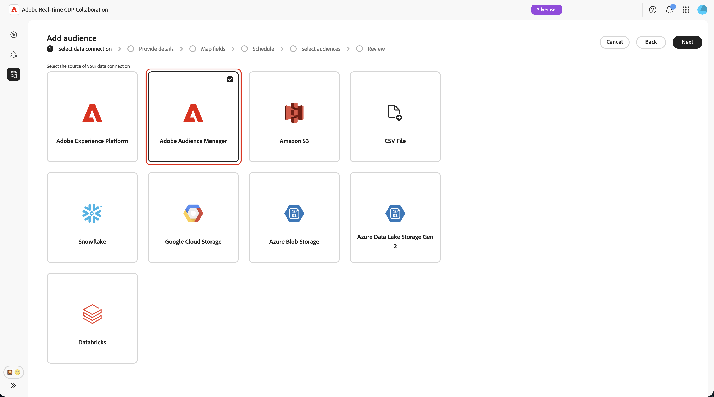
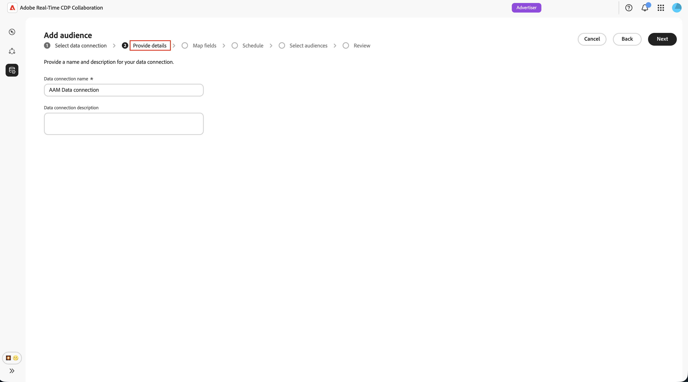

# Configurare Adobe Audience Manager per l’audience sourcing

Scopri come connettere la tua istanza di Adobe Audience Manager (AAM) ad Adobe Real-Time CDP Collaboration in modo da poter inserire nella piattaforma i segmenti di prime parti idonei. Dopo aver creato la connessione, Collaboration recupera l’iscrizione al pubblico da Adobe Audience Manager secondo una pianificazione periodica e rende tali tipi di pubblico disponibili per l’analisi di sovrapposizione e l’attivazione all’interno dei progetti di collaborazione.

>[!NOTE]
>
> I tipi di pubblico originati da Audience Manager seguono le stesse regole di governance e di gestione dei dati dei tipi di pubblico originati da Adobe Experience Platform. Sono idonei solo i segmenti generati da origini dati di prime parti. I segmenti che includono dati di terze parti o origini Audience Marketplace non sono supportati.

## Prerequisiti {#prerequisites}

Completa tutti gli elementi in questa sezione prima di avviare il flusso di lavoro di configurazione. I prerequisiti incompleti sono il motivo più comune per cui l’impostazione non riesce o i tipi di pubblico non vengono visualizzati dopo la determinazione dell’origine. Prima di seguire questa guida, devi aver completato l&#39;[onboarding e la configurazione dell&#39;account](./onboard-account.md).

### Accesso e autorizzazioni di Adobe Audience Manager {#aam-access-and-permissions}

Prima di procedere, verifica di disporre di:

* Un contratto Adobe Audience Manager attivo e un’istanza Audience Manager con provisioning.
* Accedi all’interfaccia utente di Audience Manager con l’autorizzazione per visualizzare i segmenti da sorgente.
* L’istanza di Audience Manager e l’account Collaboration dispongono del provisioning nella stessa organizzazione Adobe IMS. Il sourcing tra organizzazioni non è supportato.

### Requisiti di idoneità del segmento {#aam-segments-requirements}

Quando configuri la connessione, Collaboration filtra automaticamente l’elenco dei segmenti in base alle regole seguenti.

**Solo dati di prime parti**

Per la determinazione dell’origine sono disponibili solo i segmenti basati sui dati di prime parti. Sono esclusi i segmenti che includono caratteristiche di fornitori di dati terze parti o AAM Audience Marketplace.

**Filtro di aggiornamento**

Solo i segmenti creati o aggiornati **negli ultimi 13 mesi** sono disponibili per l&#39;approvvigionamento. I segmenti meno recenti vengono esclusi durante la configurazione della connessione e a ogni aggiornamento successivo.

### Requisiti del consenso {#consent-requirements}

Tutti i segmenti di AAM originati in Collaboration devono essere filtrati dopo il consenso. Se per un profilo è presente un marcatore di rinuncia al momento dell’esportazione, tale profilo viene escluso prima di raggiungere Collaboration.

>[!IMPORTANT]
>
>Prima di connetterti a Collaboration, assicurati che il consenso sia configurato e applicato correttamente nell’istanza di Audience Manager. Adobe non applica nuovamente le regole di consenso dopo che i dati lasciano Audience Manager.

## Configurare la connessione Audience Manager {#configure-aam-connection}

Il flusso di lavoro di configurazione è una procedura guidata in più passaggi all&#39;interno dell&#39;area di lavoro **[!UICONTROL Configurazione]**. Completa ogni passaggio in sequenza. Puoi tornare a qualsiasi passaggio utilizzando l’icona a forma di matita nella schermata di revisione finale prima di creare la connessione.

### Aggiungere una connessione dati {#add-data-connection}

Dalla scheda **[!UICONTROL Tipi di pubblico]** nell&#39;area di lavoro **[!UICONTROL Configurazione]**, selezionare l&#39;icona Aggiungi () e quindi seleziona **[!UICONTROL Pubblico]**.

Se questo è il tuo primo pubblico, puoi anche selezionare l&#39;opzione **[!UICONTROL Aggiungi pubblico]**.

Viene visualizzato il flusso di lavoro Aggiungi pubblico. Seleziona **[!UICONTROL Aggiungi una nuova connessione dati]**, quindi seleziona **[!UICONTROL Avanti]**.

{zoomable="yes"}

### Seleziona Adobe Audience Manager come connessione dati {#select-aam}

Nella schermata di selezione dell&#39;origine dati sono elencati tutti i tipi di connessione disponibili. Selezionare **[!UICONTROL Adobe Audience Manager]** come connessione dati, quindi selezionare **[!UICONTROL Next]**.

### Conferma il consenso e l’utilizzo dei dati {#confirm-consent-data-use}

Prima di procedere, verifica di aver applicato le rinunce previste dalla legge ai dati sul pubblico inviati a Collaboration. Se non sei sicuro che i tuoi dati soddisfino questo requisito, consulta la [guida ai criteri di governance e alle azioni di applicazione](./onboard-audiences.md#governance-policy-and-enforcement-actions) prima di procedere. Selezionare la casella di controllo di conferma, quindi selezionare **[!UICONTROL OK]** per continuare.

### Fornisci dettagli di connessione {#provide-connection-details}

Immettere quindi un nome e una descrizione facoltativa per la connessione dati. Dopo la creazione della connessione, il nome specificato viene visualizzato nella scheda **[!UICONTROL Le mie connessioni dati]** e consente di identificare l&#39;origine in futuro.

* **[!UICONTROL Nome connessione dati]** (obbligatorio)
* **[!UICONTROL Descrizione connessione dati]** (facoltativo)

Al termine, selezionare **[!UICONTROL Avanti]**.

### Verifica mappatura identità {#review-identity-mapping}

La schermata **[!UICONTROL Mapping]** è di sola lettura. Collaboration mappa automaticamente l’output di identità supportato dai segmenti AAM ai campi di identità Collaboration. Per ulteriori informazioni, vedere la tabella seguente.

| Output identità di AAM | Campo di identità Collaboration | Note |
| ------------------- | ---------------------------- | ----- |
| `Demdex ID` | `DEMDEX_ID` | Output di identità supportato per questa integrazione. Collaboration non traduce l’ID Demdex in ECID durante la determinazione dell’origine. |
| `GAID` | `GAID` | Output di identità supportato per questa integrazione. |
| `IDFA` | `IDFA` | Output di identità supportato per questa integrazione. |

{style="table-layout:auto"}

È possibile rivedere la mappatura, ma non modificarla in questa fase. Seleziona **[!UICONTROL Avanti]** per continuare.

### Pianifica aggiornamento dati {#schedule-data-refresh}

Nella visualizzazione **[!UICONTROL Pianifica]**, imposta la frequenza di aggiornamento con cui Collaboration recupera i dati aggiornati sull&#39;iscrizione del pubblico dai segmenti AAM e definisci l&#39;intervallo di date attivo per la determinazione origine.

Utilizza il menu a discesa **[!UICONTROL Frequenza]** per selezionare un intervallo di aggiornamento compreso tra uno e sei giorni. Quindi utilizza il calendario per impostare le date di inizio e fine per Audience sourcing. Una volta raggiunta la data di fine, la determinazione origine si interrompe e scadono i tipi di pubblico con origine precedente.

>[!IMPORTANT]
>
>In genere, i segmenti di Audience Manager vengono aggiornati ogni 24-48 ore in base all’attualità delle caratteristiche e alle regole di frequenza. Se si imposta un intervallo di aggiornamento di Collaboration più breve, potrebbero essere utilizzati crediti Collaboration senza risultati aggiornati. Per monitorare l&#39;utilizzo del credito, consulta [Monitorare l&#39;attività di consumo del credito](./my-activity.md).

Al termine, seleziona **[!UICONTROL Avanti]**.

### Seleziona tipi di pubblico {#select-audiences}

Puoi visualizzare un elenco dei segmenti idonei che utilizzano le caratteristiche dell’origine dati di prime parti e che sono stati creati o aggiornati negli ultimi 13 mesi.

Seleziona i segmenti da importare in Collaboration. Puoi cercare per nome o scorrere per trovare segmenti specifici. Al termine, seleziona **[!UICONTROL Avanti]**.

>[!TIP]
>
>Se un segmento che prevedi di visualizzare non è elencato, verifica che sia stato aggiornato negli ultimi 13 mesi e utilizzi solo le caratteristiche dell’origine dati di prime parti. Sono esclusi i segmenti con caratteristiche di terze parti o Audience Marketplace.

### Verifica e completa la connessione {#review-and-complete}

Rivedi il riepilogo completo della configurazione prima di creare la connessione. La schermata di riepilogo mostra le sezioni seguenti:

* **[!UICONTROL Dettagli]**: nome e descrizione facoltativa della connessione dati.
* **[!UICONTROL Selezione del pubblico]**: i segmenti AAM selezionati.
* **[!UICONTROL Mappatura]**: mapping dei campi di identità dai campi di origine di AAM ai campi di identità di Collaboration.
* **[!UICONTROL Pianificazione]**: frequenza di aggiornamento e intervallo di date attivo.

Seleziona l&#39;icona della matita () accanto a qualsiasi sezione se devi apportare modifiche. Seleziona **[!UICONTROL Completa]** per confermare tutte le sezioni.

Viene visualizzata una finestra di dialogo di conferma che indica che la connessione dati è stata creata e che è in corso la determinazione dell’origine del pubblico.

## Rivedere i tipi di pubblico originati {#review-sourced-audiences}

Dopo aver completato la procedura guidata, Collaboration inizia a recuperare i dati di iscrizione del pubblico dai segmenti di AAM selezionati in modo asincrono. Passa a **[!UICONTROL Configurazione] > [!UICONTROL I miei tipi di pubblico]** per monitorare l&#39;avanzamento.

### Monitorare l’avanzamento di audience sourcing {#monitor-progress}

Mentre Collaboration recupera i dati del segmento di AAM, un banner nella parte superiore dell&#39;area di lavoro **[!UICONTROL I miei tipi di pubblico]** indica che la determinazione dell&#39;origine è in corso. I singoli tipi di pubblico vengono visualizzati nell’elenco al completamento della determinazione dell’origine per ciascun segmento.

### Visualizzare i dettagli del pubblico di origine {#view-sourced-audience-details}

Al termine dell&#39;approvvigionamento, i segmenti AAM vengono visualizzati nella scheda **[!UICONTROL I miei tipi di pubblico]**. La colonna **[!UICONTROL Source]** li identifica come **[!UICONTROL Adobe Audience Manager]**.

Seleziona una riga o l&#39;opzione **[!UICONTROL Visualizza pubblico]** per aprire la visualizzazione dei dettagli di un pubblico specifico.

La vista dei dettagli mostra:

* **[!UICONTROL Identità]**: il conteggio delle identità totali ed eventuali informazioni di raggruppamento disponibili.
* **[!UICONTROL Categorie]**: qualsiasi tag applicato per organizzare o filtrare il pubblico.
* **[!UICONTROL Accesso alla connessione]**: pubblico privato, pubblico o condiviso con collaboratori specifici.
* **[!UICONTROL Visibilità metadati]**: quali informazioni sul pubblico sono visibili ai collaboratori.

![Visualizzazione dei dettagli dei singoli tipi di pubblico con Stato: Attivo, sistema di origine e nome della connessione dati nella parte superiore. Di seguito sono riportati i quattro pannelli: Identità che mostrano il conteggio e il raggruppamento delle identità, Categorie che mostrano i tag applicati, Accesso alla connessione che mostra il tipo e la visibilità dei metadati che mostrano le impostazioni per il conteggio delle identità, la percentuale di sovrapposizione e l&#39;indice del pubblico.](../../assets/setup/aam-audience-sourcing/audience-manager-sourced-audience-details.png)

Utilizza questa visualizzazione per confermare la configurazione del pubblico e le impostazioni di visibilità prima di utilizzarlo nei progetti di collaborazione. Per aggiornare le categorie, l&#39;accesso alla connessione o la visibilità dei metadati, consulta [Visualizzare e gestire singoli tipi di pubblico](./onboard-audiences.md#view-individual-audiences).

## Limitazioni note

Quando configuri e utilizzi il connettore di origine di Audience Manager, tieni presente i seguenti vincoli:

* **Solo dati di prime parti:** i segmenti che includono caratteristiche di fornitori di dati di terze parti o Adobe Audience Marketplace non possono essere originati. Sono idonei solo i segmenti generati interamente dalle tue origini dati di prime parti.
* **Intervallo di aggiornamento dei segmenti di 13 mesi:** solo i segmenti creati o aggiornati negli ultimi 13 mesi sono disponibili per la selezione durante l&#39;installazione e a ogni aggiornamento pianificato.
* **Nessun aggiornamento su richiesta:** i dati del pubblico vengono aggiornati in base alla pianificazione configurata. Manuale, aggiornamento immediato non supportato.
* **Una connessione AAM attiva per organizzazione:** È supportata una sola connessione dati AAM attiva per ogni organizzazione IMS.
* **Vincoli chiave di corrispondenza:** Una volta abilitata una chiave di corrispondenza per una connessione dati, non è possibile rimuoverla. Per modificare le chiavi di corrispondenza attive, eliminare la connessione e crearne una nuova.

## Risoluzione dei problemi {#troubleshooting}

Leggi questa sezione per risolvere i problemi comuni dopo aver stabilito la connessione iniziale.

**I tipi di pubblico non vengono visualizzati o l&#39;origine richiede più tempo del previsto**

* Il tempo di determinazione origine viene scalato in base al numero di segmenti selezionati e alla dimensione della popolazione di ciascun segmento.
* Se i tipi di pubblico non vengono visualizzati entro 24 ore, verifica che i segmenti selezionati siano ancora attivi in Audience Manager e che il conteggio della popolazione sia diverso da zero.
* Controllare la scheda **[!UICONTROL Le mie connessioni dati]** per verificare la presenza di eventuali indicatori di errore nella connessione.
* Se il problema persiste, contatta l’Assistenza clienti di Adobe indicando il nome della connessione dati e i nomi dei segmenti che non vengono visualizzati.

**Un segmento che avrei dovuto selezionare non era disponibile durante l&#39;installazione**

Conferma che il segmento:

* È stato creato o aggiornato negli ultimi 13 mesi. I segmenti precedenti non vengono visualizzati.
* Utilizza solo caratteristiche di prima parte. Sono esclusi i segmenti con caratteristiche di terze parti o Audience Marketplace.
* Appartiene all’organizzazione IMS configurata per la connessione.

**La connessione dati mostra uno stato di errore dopo l&#39;esecuzione iniziale**

* Conferma che la relazione dell’organizzazione IMS tra l’istanza di AAM e l’account Collaboration non è cambiata.
* Conferma che i segmenti selezionati esistano ancora in AAM e non siano stati eliminati.
* Se il problema persiste, [elimina la connessione](./manage-data-connection.md#delete-data-connection) e creane una nuova, oppure contatta l&#39;assistenza clienti Adobe.

## Passaggi successivi {#next-steps}

Ora hai configurato Audience Manager come origine dati in Collaboration. Al termine dell&#39;origine, i tipi di pubblico sono disponibili nell&#39;area di lavoro **[!UICONTROL Tipi di pubblico]** e pronti per essere utilizzati nei progetti di collaborazione. Se i tipi di pubblico non vengono visualizzati al termine del processo di determinazione origine iniziale, consultare la sezione [risoluzione dei problemi](#troubleshooting) in questa pagina.

Da qui, puoi:

* [Creare e gestire progetti di collaborazione](../collaborate/manage-projects.md)
* [Attivare i tipi di pubblico all’interno di un progetto](../collaborate/activate.md)
* [Verifica le sovrapposizioni e misura le prestazioni](../collaborate/measure.md)
* [Gestire le impostazioni e la visibilità del pubblico](./onboard-audiences.md)
* [Gestire le connessioni dati](./manage-data-connection.md)

Per altri metodi di determinazione dell&#39;origine del pubblico, vedi:

* [Configura [!DNL Amazon S3] per audience sourcing](./configure-aws-s3-audience-sourcing.md)
* [Configura [!DNL Google Cloud Storage] per audience sourcing](./configure-gcs-audience-sourcing.md)
* [Configura [!DNL Snowflake] per audience sourcing](./configure-snowflake-audience-sourcing.md)
* [Tipi di pubblico di Source da Experience Platform](./onboard-audiences.md)
* [Caricare un file CSV per l’audience sourcing](./upload-csv-audience-sourcing.md)
