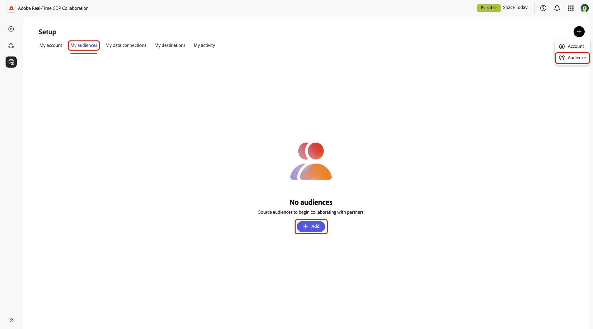
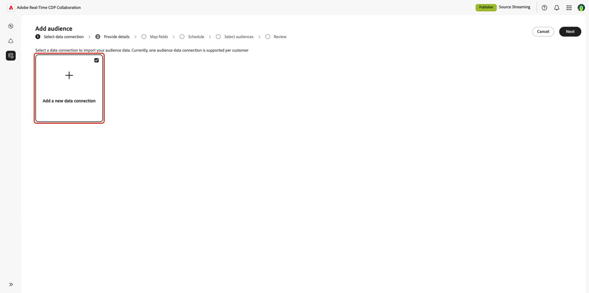

# Configura [!DNL Amazon S3] per audience sourcing

Scopri come configurare e collegare l&#39;archiviazione [!DNL Amazon S3] nell&#39;interfaccia utente di Adobe Real-Time CDP Collaboration per l&#39;origine dei dati sul pubblico per l&#39;analisi di attivazione e sovrapposizione.

>[!IMPORTANT]
>
>Prima di seguire questa guida, devi aver completato i passaggi per autorizzare il ruolo IAM di Adobe nel tuo account AWS.\
>Per istruzioni dettagliate sulla configurazione, consulta la guida **[Configurare le autorizzazioni di AWS per audience sourcing](./configure-aws-permissions-audience-sourcing.md)**.

## Panoramica {#overview}

Utilizzare questo flusso di lavoro per individuare e gestire tipi di pubblico di prime parti direttamente da [!DNL Amazon S3]. Dopo la configurazione, Collaboration origina automaticamente i tipi di pubblico dal bucket S3 e li rende disponibili per approfondimenti e attivazione.

I tipi di pubblico originati da S3 seguono le stesse regole di governance e di gestione dei dati di quelli originati da Adobe Experience Platform.

## Prerequisiti {#prerequisites}

Prima di configurare la connessione dati S3, verifica quanto segue:

* Hai accesso a un bucket **[!DNL Amazon S3]attivo** contenente file di pubblico conformi alla **[specifica di origine del pubblico (v1.1)](../../assets/quick-start/RTCDP_Collaboration_Audience_Sourcing_Spec_v1.2.pdf)**.
* Hai creato un **ruolo IAM** in AWS che concede l&#39;autorizzazione di Adobe per accedere al tuo bucket utilizzando il metodo **ruolo presunto** (non chiavi di accesso/segreto). Per istruzioni dettagliate, consulta **[Configurare le autorizzazioni di AWS per Audience sourcing](./configure-aws-permissions-audience-sourcing.md)**. Il ruolo IAM deve includere le seguenti autorizzazioni:

   * `ListBucket`
   * `GetBucketLocation`
   * `GetObject`

* Sono pronti i seguenti valori:

   * **Nome risorsa Amazon (ARN) per ruolo IAM**
   * **Nome bucket S3**
   * **Percorso cartella** (il prefisso della directory contenente i file del pubblico)

>[!NOTE]
>
>I file del pubblico devono trovarsi nel **percorso cartella principale** del bucket S3 autorizzato. Le strutture delle sottocartelle non sono supportate.

## Configura la connessione [!DNL Amazon S3] {#configure-aws-s3-connection}

Dalla scheda **[!UICONTROL Tipi di pubblico]** nell&#39;area di lavoro **[!UICONTROL Configurazione]**, selezionare l&#39;icona Aggiungi () e quindi selezionare **[!UICONTROL Pubblico]**.

Se questo è il tuo primo pubblico, puoi anche selezionare l&#39;opzione **[!UICONTROL Aggiungi]**.

Viene visualizzato il flusso di lavoro Aggiungi pubblico. Seleziona **[!UICONTROL Aggiungi una nuova connessione dati]**, quindi seleziona **[!UICONTROL Avanti]**.

{zoomable="yes"}

### Seleziona [!DNL Amazon S3] come connessione dati {#select-aws-s3}

Seleziona **[!UICONTROL Amazon S3]** come connessione dati, seguito da **[!UICONTROL Next]**.

![Schermata di selezione della connessione dati con [!DNL Amazon S3] disponibile come opzione selezionabile.](../../assets/setup/aws-audience-sourcing/select-s3-data-connection.png)

### Verifica i requisiti del file del pubblico {#review-audience-requirements}

>[!CONTEXTUALHELP]
>id="rtcdp_collaboration_audience_sourcing_specifications"
>title="Preparazione dei dati per l’onboarding"
>abstract="Leggi la guida alle specifiche di Audience Sourcing per scoprire come formattare e strutturare i dati sul pubblico da Amazon S3 per Collaboration."
>additional-url="https://www.adobe.com/go/rtcdp-collaboration-audience-sourcing" text="Consulta la guida"

Viene visualizzata una finestra di dialogo che spiega come devono essere strutturati i file del pubblico. Utilizza il collegamento alla **[[!UICONTROL specifica di Audience Sourcing]](../../assets/quick-start/RTCDP_Collaboration_Audience_Sourcing_Spec_v1.2.pdf)** per scoprire come formattare e strutturare i dati del pubblico da [!DNL Amazon S3] per consentire a Collaboration di leggerli correttamente.

>[!IMPORTANT]
>
>È necessario avere autorizzato Adobe come utente [!DNL Amazon S3] in modo che Adobe possa recuperare i dati dall&#39;archivio [!DNL Amazon S3] per l&#39;elaborazione.

I file del pubblico devono essere conformi alle specifiche di Audience Sourcing. Le chiavi di corrispondenza vengono mappate automaticamente in base al formato richiesto.

Le considerazioni principali includono:

* I file devono essere in formato CSV, utilizzando virgole come delimitatori e barre verticali (`|`) per più valori.
* In caso di caricamento di più file, assicurati che tutti i file contengano colonne identiche.
* Ogni record di pubblico deve includere `AUDIENCE_ID` e almeno una chiave di corrispondenza, ad esempio `HASHED_EMAIL_SHA_256`, `HASHED_PHONE_SHA_256`, `HASHED_IPV4_SHA_256`, `CRM_ID`, `LOYALTY_ID` o `ADFIXUS_ID`.
* Gli aggiornamenti dei dati vengono eseguiti ogni 1-6 giorni in base alla selezione effettuata durante la configurazione dell’origine in Collaboration.

### Autenticazione della connessione S3 {#authenticate-s3-connection}

>[!CONTEXTUALHELP]
>id="rtcdp_collaboration_sources_s3_folderpath"
>title="Formato percorso cartella"
>abstract="Immetti il percorso della cartella (prefisso) nel bucket [!DNL Amazon S3] in cui sono archiviati i file del pubblico. <ul><li>Non avviate i tracciati con una barra (/).</li><li>Includi una barra finale alla fine del percorso.</li><ul> Esempio valido: `base/path/` Esempio non valido: `/base/path`"

>[!CONTEXTUALHELP]
>id="rtcdp_collaboration_audience_sharing_amazon_s3"
>title="Aggiungere un pubblico per Amazon S3"
>abstract="Per collegare il tuo archivio Amazon S3, autorizza l’utente del servizio Adobe a recuperare i dati sul pubblico per l’elaborazione. Segui i passaggi descritti in Experience League per concedere ad Adobe l’accesso al tuo archivio Amazon S3."

Quindi, fornisci le credenziali [!DNL Amazon S3] per connettere il bucket S3 a Collaboration.

Segui i passaggi descritti in **[Configurare le autorizzazioni di AWS per l&#39;audience sourcing](./configure-aws-permissions-audience-sourcing.md)** per concedere ad Adobe l&#39;accesso al tuo
Archiviazione [!DNL Amazon S3]. Una volta completato, inserisci i valori nei seguenti campi dell’interfaccia utente:

* Ruolo IAM
* Nome bucket S3
* Percorso cartella

![Modulo di connessione [!DNL Amazon S3] con campi per ruolo IAM, nome bucket S3 e percorso cartella.](../../assets/setup/aws-audience-sourcing/s3-authentication-credentials-form.png)

### Conferma la conferma del consenso {#confirm-consent}

Devi quindi confermare che le rinunce al consenso sono state rimosse prima di procedere. Seleziona la casella di conferma seguita da **[!UICONTROL OK]** per confermare.

### Convalida risultati autenticazione {#validate-authentication}

Dopo la connessione, il sistema convalida le credenziali e visualizza uno dei seguenti messaggi:

| Stato | Messaggio | Descrizione |
|---| ---|---|
| **Operazione riuscita** | **[!UICONTROL Autenticazione completata]** | La connessione a [!DNL Amazon S3] è stata stabilita. |
| **Non riuscito** | **[!UICONTROL Autenticazione non riuscita]** | Controlla le credenziali e riprova. |
| **Accesso negato** | **[!UICONTROL Accesso negato]** | Le credenziali non dispongono delle autorizzazioni necessarie per accedere a questo bucket [!DNL Amazon S3]. Verificare le impostazioni di accesso o contattare l&#39;amministratore. |
| **Formato file non valido** | **[!UICONTROL Formato file non valido]** | I dati del pubblico non corrispondono alla struttura prevista. Assicurati che i file siano conformi alle Specifiche di Audience Sourcing. |
| **Nessun file di pubblico trovato** | **[!UICONTROL Nessun file di pubblico trovato]** | Conferma che i file del pubblico siano presenti nel percorso di cartella specificato e che il percorso sia accessibile. |
| **Errore interno** | **[!UICONTROL Si è verificato un errore interno]** | Riprova. Se il problema persiste, contatta l’assistenza clienti. |

### Fornisci dettagli di connessione {#provide-connection-details}

Immettere un nome descrittivo e una descrizione facoltativa per la connessione dati S3. Inserisci i valori nei seguenti campi dell’interfaccia utente:

* **[!UICONTROL Nome connessione dati]** (obbligatorio)
* **[!UICONTROL Descrizione connessione dati]** (facoltativo)

### Rivedi campi di identità mappati automaticamente {#auto-mapped-fields}

La schermata **[!UICONTROL Mapping]** è di sola lettura. Non è possibile aggiungere, eliminare o applicare trasformazioni. Collaboration mappa automaticamente i campi di identità di origine dai file del pubblico ai campi di destinazione in base alle specifiche di Audience Sourcing.

Conferma visivamente i campi mappati e seleziona **[!UICONTROL Avanti]** per continuare.

### Pianificazione della frequenza di aggiornamento e dell’intervallo di date {#schedule-refresh}

Viene visualizzata la visualizzazione **[!UICONTROL Pianificazione]**. Utilizza il menu a discesa per selezionare una frequenza di aggiornamento compresa tra uno e sei giorni, quindi imposta l’intervallo di date attivo. Utilizza l’icona del calendario per specificare le date di inizio e fine.

>[!IMPORTANT]
>
>Per gestire in modo efficace i crediti Collaboration, imposta la frequenza di aggiornamento in modo che corrisponda o superi la frequenza di aggiornamento dei dati S3 sottostanti. L&#39;intervallo minimo di aggiornamento supportato è una volta ogni sei giorni.

### Verifica e completa la connessione {#review-and-complete}

Infine, controlla le impostazioni di configurazione nella schermata di riepilogo. Questa visualizzazione contiene un riepilogo delle sezioni riportate di seguito.

* **[!UICONTROL Connessione dati]**: visualizza il ruolo IAM, il nome del bucket S3 e il percorso della cartella configurati.
* **[!UICONTROL Dettagli]**: mostra il nome e la descrizione facoltativa della connessione dati per consentirne l&#39;identificazione in un secondo momento.
* **[!UICONTROL Mappatura]**: elenca il modo in cui i campi di origine dei file di pubblico caricati (ad esempio, `HASHED_EMAIL`) vengono mappati sui campi di destinazione utilizzati in Collaboration (ad esempio, e-mail con hash).
* **[!UICONTROL Pianificazione]**: riepiloga la frequenza con cui la connessione aggiorna i dati del pubblico e l&#39;intervallo di date attivo per la determinazione origine.

Se devi modificare una sezione, fai clic sull’icona a forma di matita. Seleziona **[!UICONTROL Completa]** per confermare tutte le sezioni.

Viene visualizzata una finestra di dialogo di conferma che indica che la connessione dati è stata creata correttamente e che l’origine del pubblico è in corso.

## Rivedere i tipi di pubblico originati {#review-sourced-audiences}

Dopo aver completato la configurazione, Collaboration inizia a rifornirsi di tipi di pubblico dal bucket S3. I tipi di pubblico originati da un bucket [!DNL Amazon S3] vengono visualizzati nella scheda **[!UICONTROL Tipi di pubblico]** e hanno le stesse funzionalità e informazioni dei tipi di pubblico originati da Experience Platform.

Se il sondaggio del pubblico è in corso, nella parte superiore dello schermo viene visualizzato un banner. I singoli tipi di pubblico vengono visualizzati solo al termine della determinazione dell&#39;origine.

![La scheda Tipi di pubblico indica che la determinazione origine è in corso per [!DNL Amazon S3] tipi di pubblico.](../../assets/setup/aws-audience-sourcing/s3-audiences-sourcing-in-progress.png)

Una volta originato il pubblico S3, l’elenco dei tipi di pubblico disponibili viene fornito in una vista a schede o a schede.

>[!TIP]
>
>Il tempo di Audience sourcing varia in base alle dimensioni dei dati S3 e alla frequenza di aggiornamento configurata. Set di dati più grandi o pianificazioni di aggiornamento meno frequenti potrebbero richiedere più tempo per essere visualizzati nell&#39;area di lavoro **[!UICONTROL I miei tipi di pubblico]**.

In visualizzazione griglia o tabella, selezionare un elemento riga o **[!UICONTROL Visualizza pubblico]** per visualizzare una panoramica di un pubblico specifico. Mostra lo stato del pubblico, l’origine e il nome della connessione dati, insieme a pannelli dettagliati per:

**[!UICONTROL Identità]**: mostra il conteggio e il raggruppamento delle identità totali quando i dati diventano disponibili.
**[!UICONTROL Categorie]**: elenca i tag utilizzati per organizzare o filtrare il pubblico.
**[!UICONTROL Accesso alla connessione]**: indica se il pubblico è privato, pubblico o condiviso con collaboratori specifici.
**[!UICONTROL Visibilità metadati]**: definisce quali informazioni sul pubblico (come il conteggio delle identità, la percentuale di sovrapposizione e l&#39;indice) sono visibili ai collaboratori.

Utilizza questa visualizzazione per confermare la configurazione del pubblico e le impostazioni di visibilità prima di utilizzarlo nei progetti di collaborazione.

Per ulteriori informazioni, consulta la [Documentazione del dashboard tipi di pubblico](https://experienceleague.adobe.com/en/docs/real-time-cdp-collaboration/using/setup/onboard-audiences#view-audiences-dashboard).

## Visualizzare la connessione dati S3 {#view-s3-connection}

La connessione [!DNL Amazon S3] appena aggiunta è immediatamente disponibile nella scheda **[!UICONTROL Le mie connessioni dati]**. L&#39;origine del pubblico viene visualizzata come [!UICONTROL Amazon S3].

La connessione dati S3 include le stesse funzionalità e gli stessi dettagli delle altre connessioni dati per il pubblico, con la differenza che non è possibile aggiungere o modificare tipi di pubblico direttamente da questa vista.

>[!NOTE]
>
>[!DNL Amazon S3] connessioni dati non modificabili. Una volta creata la connessione, non è possibile modificare impostazioni quali la frequenza di aggiornamento. Per aggiornare la configurazione, devi eliminare la connessione esistente e crearne una nuova.

![La scheda Le mie connessioni dati mostra la connessione dati [!DNL Amazon S3] con le informazioni sullo stato dell&#39;origine.](../../assets/setup/aws-audience-sourcing/s3-data-connections-tab.png)

## Passaggi successivi {#next-steps}

L&#39;archiviazione [!DNL Amazon S3] è stata configurata e connessa come origine dati in Collaboration. Completando questo flusso di lavoro, hai attivato l’origine sicura dei dati del pubblico di prime parti per l’attivazione e l’analisi di sovrapposizione.

Al termine dell&#39;origine, i tipi di pubblico vengono visualizzati nell&#39;area di lavoro **[!UICONTROL Tipi di pubblico personali]**, pronti per la collaborazione e l&#39;attivazione. Per informazioni dettagliate sulle opzioni di gestione, consulta la [documentazione relativa all&#39;origine e alla gestione del pubblico](./onboard-audiences.md).
