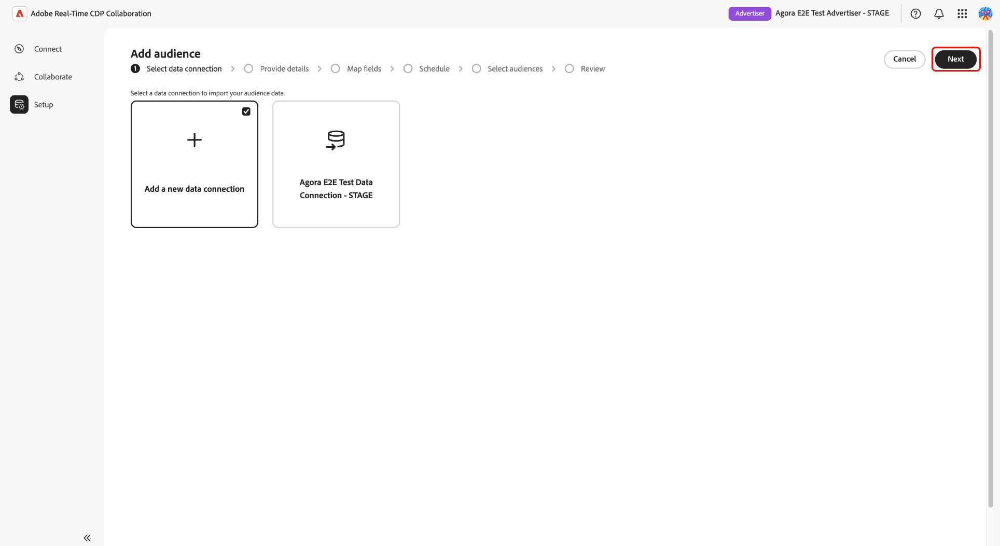

# Tipi di pubblico di Source dall’archiviazione Azure

Connetti [!DNL Azure Blob Storage] o [!DNL Azure Data Lake Storage] (ADLS) Gen2 ad Adobe Real-Time CDP Collaboration per generare i dati del pubblico di prime parti per l’analisi di attivazione e sovrapposizione.

Utilizzare questa guida per creare una connessione dati [!DNL Azure] riutilizzabile ed eseguire un&#39;importazione una tantum dal percorso di archiviazione configurato. Prima di iniziare, verifica che i file del pubblico soddisfino le [specifiche di Audience Sourcing](../../assets/quick-start/RTCDP_Collaboration_Audience_Sourcing_Spec_v1_3.pdf). Durante il processo di configurazione, potrai concedere ad Adobe l’accesso in lettura allo storage Azure.

## Scegli il tipo di origine [!DNL Azure] {#choose-source-type}

Collaboration supporta due opzioni di acquisizione di [!DNL Azure]. Utilizza la tabella seguente per scegliere il percorso della guida che corrisponde alla posizione in cui vivono i file del pubblico.

| | **[!DNL Azure Blob Storage]** | **[!DNL Azure Data Lake Storage]Gen2** |
|---|---|---|
| **Usa quando** | I file si trovano in un BLOB standard **contenitore** su un account di archiviazione (non è richiesto alcuno spazio dei nomi gerarchico). | I file si trovano in un **filesystem** su un account di archiviazione con **spazio dei nomi gerarchico abilitato (ADLS Gen2)**. |
| **Opzione Source in Collaboration** | **[!DNL Azure Blob Storage]** | **[!DNL Azure Data Lake Storage]Gen2** |
| **Campi obbligatori in Collaboration** | Account di archiviazione, **[!UICONTROL Contenitore]**, **[!UICONTROL Percorso]** | Account di archiviazione, **[!UICONTROL Contenitore]** (file system ADLS Gen2), **[!UICONTROL Percorso]** |
| **Sezione autorizzazioni** | [[!DNL Azure Blob] autorizzazioni](#set-up-azure-blob-storage-permissions) | [[!DNL Azure Data Lake Storage] Autorizzazioni Gen2](#set-up-adls-gen2-permissions) |

È possibile configurare solo **un tipo di origine per connessione dati**. Per creare l&#39;origine sia da [!DNL Blob] che da ADLS, creare connessioni dati separate.

## Prerequisiti {#prerequisites}

Prima di seguire questa guida, completa l&#39;onboarding e la configurazione dell&#39;[account](./onboard-account.md). Quindi completa i prerequisiti in questa sezione prima di avviare il flusso di lavoro di configurazione.

Alcuni passaggi richiedono l&#39;intervento di un amministratore **[!DNL Azure]**. Se non sei l&#39;amministratore [!DNL Azure] per la tua organizzazione, identifica la persona appropriata prima di iniziare.

### Accesso e autorizzazioni [!DNL Azure] {#azure-access-and-permissions}

Prima di configurare la connessione in Collaboration, l&#39;utente o l&#39;amministratore di [!DNL Azure] deve concedere ad Adobe l&#39;accesso in lettura al contenitore di archiviazione o al file system ADLS Gen2 che contiene i file di pubblico. Una volta completata la configurazione delle autorizzazioni, il flusso di lavoro di configurazione di Collaboration convalida l&#39;accesso durante il passaggio **[!UICONTROL Consenso]**.

### Preparare i dati sul pubblico {#prepare-audience-data}

I file del pubblico devono essere conformi alla **[Specifica di origine del pubblico (v1.2)](../../assets/quick-start/RTCDP_Collaboration_Audience_Sourcing_Spec_v1_3.pdf)** prima dell&#39;inizio dell&#39;origine.

I requisiti principali includono:

* **Formato file:** CSV, utilizzando virgole come delimitatori di campo e barre verticali (`|`) come separatori per più valori all&#39;interno di un singolo campo.
* **Campi obbligatori:** Ogni record deve includere una colonna `AUDIENCE_ID` e almeno una colonna chiave di corrispondenza supportata.
* **Chiavi di corrispondenza supportate:** `HASHED_EMAIL_SHA_256`, `HASHED_PHONE_SHA_256`, `HASHED_IPV4_SHA_256`, `CRM_ID`, `LOYALTY_ID`, `ADFIXUS_ID`.
* **Requisiti di hashing:** tutti i valori chiave di corrispondenza devono essere tagliati, in minuscolo e con hash SHA256 prima del caricamento. Collaboration non esegue l’hashing o la normalizzazione dei dati prima dell’acquisizione.
* **Coerenza colonna:** tutti i file nel percorso configurato devono utilizzare strutture di colonna identiche.

Tutte le chiavi di corrispondenza presenti nei file del pubblico devono essere abilitate anche per il tuo account Collaboration. Consulta [Configurare le chiavi di corrispondenza](https://experienceleague.adobe.com/it/docs/real-time-cdp-collaboration/using/setup/onboard-account#set-up-match-keys) per maggiori informazioni.

>[!IMPORTANT]
>
> Le chiavi di corrispondenza abilitate per una connessione dati non possono essere rimosse dopo la creazione della connessione. Per modificare il set attivo di chiavi di corrispondenza, è necessario eliminare la connessione e crearne una nuova. Conferma la configurazione completa della chiave di corrispondenza prima di avviare il flusso di lavoro di configurazione.

### Valori richiesti prima di iniziare {#values-required}

Prepara i seguenti valori prima di avviare il flusso di lavoro di configurazione.

| Valore | Descrizione | Esempio di archiviazione BLOB di Azure | Esempio ADLS Gen2 |
| ------------------- | ------------------------ | -------------------------------------- | -------------------------------------- |
| **Account di archiviazione** | Nome dell&#39;account di archiviazione [!DNL Azure] che ospita i file del pubblico. | `customerdatastore` | `datalake-prod` |
| **Contenitore** | Per [!DNL Azure Blob Storage], il contenitore di archiviazione che contiene i file del pubblico. Per [!DNL Azure Data Lake Storage] Gen2, immettere il nome del file system ADLS Gen2 nel campo **[!UICONTROL Contenitore]**. | `audience-ingest` | `audiences` |
| **Percorso** | Percorso della cartella all’interno del contenitore o del file system che contiene i file del pubblico da acquisire. Collaboration acquisisce solo i file direttamente nel percorso configurato e non i file dalle sottocartelle nidificate. | `sourcing/audiences/path1/` | `sourcing/inbound/` |
| **ID tenant** | L&#39;ID tenant Microsoft Entra associato all&#39;account di archiviazione [!DNL Azure]. | `00000000-0000-0000-0000-000000000000` | `00000000-0000-0000-0000-000000000000` |

## Configura autorizzazioni [!DNL Azure] {#set-up-azure-permissions}

Completa i passaggi descritti in questa sezione per preparare l&#39;ambiente [!DNL Azure]. Adobe richiede l’accesso in lettura al contenitore di archiviazione prima che il flusso di lavoro di configurazione Collaboration possa stabilire una connessione. Questo lavoro viene eseguito nel portale [!DNL Azure] e potrebbe dover essere completato dall&#39;amministratore [!DNL Azure].

Dopo aver completato questa sezione, passare a [Configurare la  [!DNL Azure] connessione](#configure-your-azure-connection).

### Ottenere l&#39;identificatore dell&#39;entità servizio [!DNL Azure] di Adobe {#obtain-principal-identifier}

Prima di completare i passaggi di assegnazione dei ruoli riportati di seguito, contattare il team dell&#39;account Adobe per ottenere l&#39;identificatore dell&#39;entità servizio [!DNL Azure] per la propria area geografica (Nord America, EMEA, Australia e Nuova Zelanda). Utilizzerai questo identificatore per concedere ad Adobe l&#39;accesso in lettura al tuo archivio.

### Configura autorizzazioni [!DNL Azure Blob Storage] {#set-up-azure-blob-storage-permissions}

>[!IMPORTANT]
>
> È necessaria l&#39;autorizzazione per assegnare ruoli all&#39;account o al contenitore di archiviazione (ad esempio, **Proprietario** o **Amministratore degli accessi utente** o equivalente).

1. Nel [[!DNL Azure] portale](https://portal.azure.com/), apri l&#39;account di archiviazione, quindi vai a **[!UICONTROL Contenitori]** e seleziona il contenitore che contiene i tuoi file di pubblico.
2. Seleziona **[!DNL Access control (IAM)]**, quindi seleziona **[!DNL Add role assignment]**.
3. Assegnare il ruolo **[!DNL Storage Blob Data Reader]** all&#39;entità di Adobe nell&#39;ambito del contenitore.
4. Seleziona **Salva**.

### Configurare le autorizzazioni ADLS Gen2 {#set-up-adls-gen2-permissions}

Per le connessioni ADLS Gen2, il campo **[!UICONTROL Container]** in Collaboration corrisponde al file system ADLS Gen2 in [!DNL Azure]. Utilizza il file system che contiene i file del pubblico.

Prima di assegnare le autorizzazioni, verifica che l&#39;account di archiviazione abbia **spazio dei nomi gerarchico abilitato** e che le regole firewall o endpoint privato consentano l&#39;accesso ad Adobe.

1. Nel [[!DNL Azure] portale](https://portal.azure.com/), aprire l&#39;account di archiviazione che contiene il file system ADLS Gen2.
2. Apri il file system che contiene i file del pubblico.
3. Selezionare **[!UICONTROL Controllo dell&#39;accesso (IAM)]**, quindi selezionare **[!UICONTROL Aggiungi assegnazione ruolo]**.
4. Assegnare il ruolo **[!DNL Storage Blob Data Reader]** all&#39;entità Adobe nell&#39;ambito del file system o della directory.
5. Seleziona **[!UICONTROL Salva]**.

Dopo aver completato l&#39;impostazione delle autorizzazioni per il tipo di origine, passare a [Configurare la  [!DNL Azure] connessione](#configure-your-azure-connection).

## Configura la connessione [!DNL Azure] {#configure-your-azure-connection}

Utilizza il flusso di lavoro di configurazione di Collaboration per convalidare i dettagli di archiviazione di [!DNL Azure], confermare l&#39;accesso ad Adobe, rivedere i campi di identità mappati automaticamente e creare la connessione dati.

### Aggiungi una nuova connessione dati {#add-new-data-connection}

Passa a **[!UICONTROL Configurazione]** > **[!UICONTROL Tipi di pubblico]**, quindi seleziona l&#39;icona Aggiungi () e scegli **[!UICONTROL Pubblico]**.

{zoomable="yes"}

Viene visualizzato il flusso di lavoro **[!UICONTROL Aggiungi pubblico]**. Seleziona **[!UICONTROL Aggiungi una nuova connessione dati]**, quindi seleziona **[!UICONTROL Avanti]**.

{zoomable="yes"}

### Seleziona l&#39;origine dati [!DNL Azure] {#select-azure-data-source}

Seleziona **[!UICONTROL Archiviazione BLOB Azure]** o **[!UICONTROL Archiviazione Data Lake Azure Gen2]**, quindi seleziona **[!UICONTROL Avanti]**.

![Il flusso di lavoro Aggiungi pubblico mostra [!DNL Azure Blob Storage] selezionato come tipo di connessione dati e i passaggi di onboarding Credenziali, Consenso, Mappatura campi e Revisione.](../../assets/setup/azure-sourcing/azure-source-selection-step.png){zoomable="yes"}

Continua i passaggi rimanenti per convalidare la connessione Azure, confermare l’accesso ad Adobe, rivedere le mappature dei campi e creare la connessione dati.

### Immetti le credenziali di connessione {#enter-connection-credentials}

Nel passaggio **[!UICONTROL Credenziali]**, fornisci le informazioni necessarie per accedere al percorso di archiviazione [!DNL Azure].

| Campo | Descrizione |
|---|---|
| **[!UICONTROL Account di archiviazione]** | Account di archiviazione [!DNL Azure] contenente i file del pubblico. |
| **[!UICONTROL Contenitore]** | Il contenitore di archiviazione o il file system ADLS Gen2 che contiene i file di pubblico. |
| **[!UICONTROL Percorso]** | Il percorso della cartella all’interno del contenitore in cui sono memorizzati i file del pubblico. |
| **[!UICONTROL ID tenant]** | L&#39;identificatore tenant [!DNL Azure] associato al tuo account di archiviazione. |

Dopo aver immesso i valori richiesti, selezionare **[!UICONTROL Connetti ad Azure]**.

Un messaggio di conferma indica che la connessione è stata stabilita correttamente. Seleziona **[!UICONTROL Avanti]** per continuare.

![Il passaggio Credenziali che mostra i campi Account di archiviazione, Contenitore, Percorso e ID tenant completati con un messaggio di conferma Connesso a [!DNL Azure].](../../assets/setup/azure-sourcing/azure-credentials-step.png){zoomable="yes"}

### Concedi l&#39;accesso Adobe al tuo archivio [!DNL Azure] {#grant-adobe-access}

Nel passaggio **[!UICONTROL Consenso]**, Collaboration convalida le autorizzazioni [!DNL Azure] configurate in precedenza.

Seleziona l&#39;icona di avvio accanto a **[!UICONTROL URL di consenso]** per aprire il flusso di lavoro di autorizzazione in [!DNL Azure]. Accedi con un account che disponga dell’autorizzazione per concedere il consenso per il percorso di archiviazione, quindi completa le richieste di autorizzazione di Azure che concedono l’accesso di Adobe al percorso di archiviazione configurato. Al termine dell&#39;autorizzazione, tornare a Collaboration e selezionare **[!UICONTROL Conferma consenso]** per convalidare l&#39;accesso di Adobe.

>[!NOTE]
>
>La propagazione delle assegnazioni di ruolo [!DNL Azure] può richiedere alcuni minuti. Se la convalida del consenso non riesce immediatamente, attendi alcuni minuti, verifica che l’entità servizio di Adobe disponga dell’assegnazione del ruolo richiesta, quindi riprova.

Quando la convalida del consenso viene eseguita correttamente, viene visualizzato un messaggio di conferma **[!UICONTROL Consenso concesso]**. Seleziona **[!UICONTROL Avanti]** per continuare.

![Il passaggio Consenso mostra un URL di consenso, l&#39;identificatore dell&#39;applicazione \[!DNL Azure\] e un messaggio di conferma del consenso concesso.](../../assets/setup/azure-sourcing/azure-consent-granted-step.png){zoomable="yes"}

### Rivedi mappature campi {#review-field-mappings}

Nel passaggio **[!UICONTROL Mappatura campi]**, Collaboration mappa automaticamente i campi di identità supportati dai file di origine.

Non è richiesta alcuna configurazione manuale.

>[!IMPORTANT]
>
> Collaboration mappa automaticamente i campi di identità in base alle specifiche di Audience Sourcing. Se le mappature visualizzate non sono corrette, aggiorna i file di origine prima di completare il flusso di lavoro di onboarding.

Esamina le mappature visualizzate e verifica che i campi sorgente corrispondano alle colonne di identità nei file di pubblico. Seleziona **[!UICONTROL Avanti]** per continuare.

{zoomable="yes"}

### Verifica e completa la connessione {#review-and-complete}

Nel passaggio **[!UICONTROL Rivedi]**, verifica le mappature dell&#39;account di archiviazione, del contenitore, del percorso di origine, dell&#39;ID tenant e dei campi.

La pagina Revisione indica inoltre che il flusso di lavoro [!DNL Azure] corrente esegue una singola esecuzione dell&#39;origine e non configura una pianificazione ricorrente.

Quando la configurazione è corretta, selezionare **[!UICONTROL Completa]**.

{zoomable="yes"}

## Conferma la connessione e monitora i tipi di pubblico originati {#confirm-connection-and-monitor-audiences}

Dopo aver selezionato **[!UICONTROL Completa]**, Collaboration crea la connessione dati e passa a **[!UICONTROL Configurazione]** > **[!UICONTROL Le mie connessioni dati]**.

### Conferma la creazione della connessione {#confirm-connection-created}

La scheda di connessione in **[!UICONTROL Le mie connessioni dati]** conferma che la connessione è stata creata correttamente. Nella scheda vengono visualizzati il tipo di origine (**[!UICONTROL Archiviazione BLOB di Azure]** o **[!UICONTROL Archiviazione Data Lake di Azure] Gen2**), la data di creazione, le chiavi di corrispondenza, il conteggio del pubblico e lo stato della connessione corrente.

![La visualizzazione Connessioni dati personali mostra una nuova scheda di connessione [!DNL Azure Blob Storage] con dettagli di connessione, chiavi di corrispondenza, conteggio del pubblico e informazioni sullo stato.](../../assets/setup/azure-sourcing/azure-data-connection-card.png){zoomable="yes"}

### Visualizzare i tipi di pubblico sorgente {#view-sourced-audiences}

Dopo la creazione della connessione, Collaboration inizia automaticamente a raccogliere i tipi di pubblico dalla posizione [!DNL Azure] configurata. Passa a **[!UICONTROL Configurazione]** > **[!UICONTROL I miei tipi di pubblico]** per monitorare l&#39;avanzamento dell&#39;origine e rivedere i tipi di pubblico originati.

I tipi di pubblico sorgente vengono visualizzati nella tabella **[!UICONTROL Tipi di pubblico]**. Utilizza lo stato del pubblico, il conteggio delle identità, l&#39;origine, la connessione dati e la data dell&#39;ultimo aggiornamento per confermare che i tipi di pubblico previsti provengono dalla connessione [!DNL Azure].

>[!TIP]
>
>Il tempo di determinazione origine varia in base al volume dei dati. Se il pubblico non viene visualizzato dopo 24 ore, vedere [Risoluzione dei problemi](#troubleshooting).

## Limitazioni note {#known-limitations}

Esamina le seguenti limitazioni prima di creare o gestire una connessione dati di Azure.

* **Vincoli chiave di corrispondenza:** Le chiavi di corrispondenza non possono essere rimosse da una connessione esistente. Per modificare le chiavi di corrispondenza attive, eliminare la connessione e crearne una nuova.
* **Una connessione attiva per tipo di origine [!DNL Azure]:** È possibile avere una connessione BLOB attiva e una connessione ADLS Gen2 attiva per account. Per modificare il percorso di archiviazione, eliminare la connessione esistente e crearne una nuova.
* **Supporto sottocartelle:** Collaboration acquisisce solo i file direttamente nel percorso configurato. Non acquisisce i file dalle sottocartelle nidificate.
* **Tipi di origine separati:** Blob e ADLS Gen2 sono connessioni distinte. Non combinare le configurazioni in un&#39;unica esecuzione della procedura guidata.

## Risoluzione dei problemi {#troubleshooting}

### I tipi di pubblico non vengono visualizzati o l&#39;approvvigionamento è lento {#audiences-not-appearing}

Se i tipi di pubblico originati non vengono visualizzati dopo la creazione della connessione, completa le azioni seguenti.

* Verifica che i file del pubblico siano presenti direttamente nel percorso configurato e siano conformi alle specifiche di Audience Sourcing.
* Verificare la presenza di errori nelle **[!UICONTROL connessioni dati personali]**.
* Se i problemi persistono dopo 24 ore, contatta il supporto Adobe con il nome della connessione, l’account di archiviazione e i dettagli del contenitore.

### Origine del pubblico ma senza identità o identità impreviste {#zero-identities}

Se i tipi di pubblico vengono visualizzati dopo la determinazione dell’origine ma i conteggi delle identità sono pari a zero o inferiori a quelli previsti, completa le azioni seguenti.

* Verifica che tutti i valori delle chiavi corrispondenti nei file del pubblico siano stati tagliati, convertiti in minuscolo e con hash SHA256 prima del caricamento. Collaboration non esegue l’hashing o la normalizzazione dei dati al momento dell’acquisizione.
* Verifica che le chiavi di corrispondenza presenti nei file siano abilitate per il tuo account Collaboration. Vedere [Configurare le chiavi di corrispondenza](https://experienceleague.adobe.com/it/docs/real-time-cdp-collaboration/using/setup/onboard-account#set-up-match-keys).

### Connessione non riuscita dopo il completamento iniziale {#connection-failed}

Utilizzare questi controlli quando una connessione è stata creata correttamente ma successivamente entra in uno stato di errore.

* Verificare che l&#39;assegnazione del ruolo RBAC [!DNL Azure] per l&#39;entità Adobe non sia stata rimossa o limitata.
* I file di conferma esistono ancora nel percorso e corrispondono alla specifica.

### Importare o formattare gli errori {#format-errors}

Utilizzare questi controlli quando la determinazione origine non riesce a causa di problemi di struttura del file, hashing o formato colonna.

* Assicurati che tutti i file mantengano la stessa struttura di colonne e le stesse regole di hashing dell’acquisizione iniziale.

## Passaggi successivi {#next-steps}

Al termine dell&#39;origine, i tipi di pubblico sono disponibili in **[!UICONTROL I miei tipi di pubblico]** per l&#39;attivazione, l&#39;analisi di sovrapposizione e i flussi di lavoro di misurazione. Per attivare i tipi di pubblico originati con i collaboratori, vedi [Attiva tipi di pubblico](../collaborate/activate.md).

Altri metodi di determinazione origine disponibili includono Experience Platform, [!DNL Amazon S3], [!DNL Google Cloud Storage], [!DNL Snowflake] e il caricamento di file CSV. Per altri metodi di determinazione dell&#39;origine del pubblico, vedi:

* [Configurare Google Cloud Storage per audience sourcing](./configure-gcs-audience-sourcing.md)
* [Configurare Snowflake per l’audience sourcing](./configure-snowflake-audience-sourcing.md)
* [Configurare AWS S3 per l’audience sourcing](./configure-aws-s3-audience-sourcing.md)
* [Tipi di pubblico di Source da Experience Platform](./onboard-audiences.md)
* [Caricare un file CSV per l’audience sourcing](./upload-csv-audience-sourcing.md)
