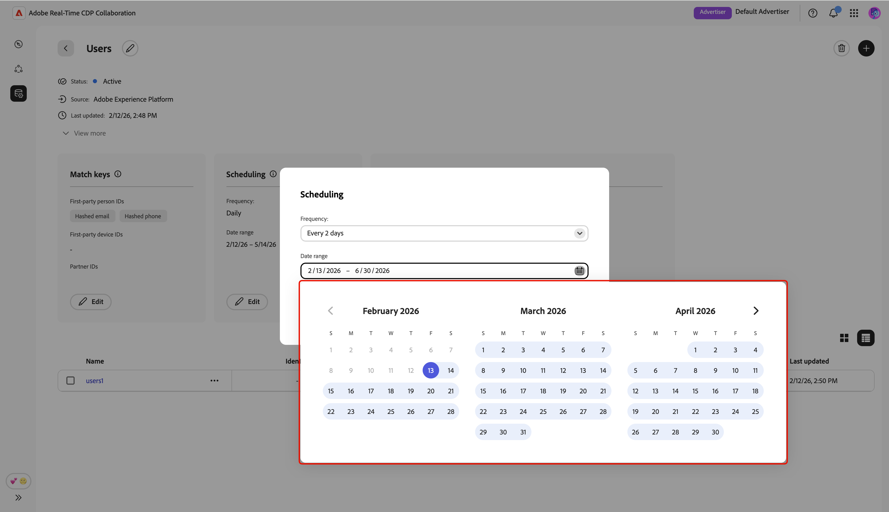

# Gestisci connessioni dati

{{limited-availability-release-note}}

## Panoramica

Utilizza le connessioni dati in Real-Time CDP Collaboration per indirizzare il pubblico da varie piattaforme. Scopri come gestire le chiavi di corrispondenza e pianificare l’aggiornamento dei dati per le connessioni dati esistenti. Inoltre, potrai filtrare i tipi di pubblico in base a attributi diversi per ottenere informazioni più granulari.

## Visualizzare connessioni dati

Per visualizzare le connessioni dati esistenti, passare a **[!UICONTROL Configurazione]** e selezionare la scheda **[!UICONTROL Connessioni dati personali]**. Viene visualizzata tutta la connessione dati corrente, con una breve panoramica di ogni connessione. Per una visualizzazione completa delle informazioni di una connessione dati, incluse le chiavi di corrispondenza, i dettagli di pianificazione e i tipi di pubblico, selezionare **[!UICONTROL Visualizza connessione dati]** nella connessione corrispondente.

{zoomable="yes"}

### Chiavi di corrispondenza {#match-keys}

>[!CONTEXTUALHELP]
>id="rtcdp_collaboration_manage_dataconnections_matchkeys"
>title="Chiavi di corrispondenza"
>abstract="Le chiavi di corrispondenza determinano il modo in cui verranno abbinati i dati provenienti da origini diverse. Le chiavi di corrispondenza mostrate di seguito sono i campi di destinazione a cui hai mappato i campi sorgente."

Le chiavi di corrispondenza sono i campi di destinazione [sui quali hai mappato i campi di origine](./onboard-audiences.md#map-fields). Per ulteriori informazioni sul funzionamento delle chiavi di corrispondenza, consulta la guida [chiavi di corrispondenza](./onboard-account.md#set-up-match-keys).

{zoomable="yes"}

### Pianificazione {#scheduling}

>[!CONTEXTUALHELP]
>id="rtcdp_collaboration_manage_dataconnections_scheduling"
>title="Pianificazione"
>abstract="Visualizza i dettagli di pianificazione per la connessione dati e, se necessario, modifica le configurazioni."

Visualizza e gestisci le impostazioni di pianificazione per le connessioni dati. La pianificazione determina la frequenza con cui il pubblico viene aggiornato.

Dopo aver creato una connessione dati, è possibile aggiornarne la frequenza di aggiornamento, la data di inizio e la data di fine direttamente dalla sezione **[!UICONTROL Pianificazione]** dell&#39;area di lavoro connessione dati.

>[!NOTE]
>
>Quando si selezionano i tipi di pubblico da Adobe Experience Platform, i tipi di pubblico diventano disponibili entro 24 ore dall’impostazione della connessione dati. Dopo l’origine iniziale, i dati del pubblico vengono aggiornati in base alla frequenza definita.

Per ulteriori informazioni sulla pianificazione, consulta la [sezione pianificazione](/help/guide/setup/onboard-audiences.md#schedule) nella guida alla configurazione dei tipi di pubblico.

{zoomable="yes"}

## Modifica connessione dati {#edit-data-connection}

Leggi le sezioni seguenti per scoprire come aggiornare le chiavi di corrispondenza e le impostazioni di pianificazione di una connessione dati esistente.

### Modifica chiavi di corrispondenza {#edit-match-keys}

>[!CONTEXTUALHELP]
>id="rtcdp_collaboration_edit_measurement_data_connection_enrichment"
>title="Arricchimento"
>abstract="La disattivazione dell’arricchimento non è supportata. In alternativa, puoi modificare le chiavi di unione per l’arricchimento."
>additional-url="https://www.adobe.com/go/rtcdp-collaboration-manage-dataconnections" text="Arricchimento"

>[!IMPORTANT]
>
>Prima di modificare le chiavi di corrispondenza per una connessione dati, tieni presente quanto segue:
>
>* Per le connessioni dati è possibile utilizzare solo le chiavi di corrispondenza configurate per il tuo account.
>* Al momento, è possibile aggiungere altre chiavi di corrispondenza a una connessione dati, ma una volta abilitata, una chiave di corrispondenza non può essere rimossa.

Seleziona **[!UICONTROL Modifica]** dalla sezione **[!UICONTROL Corrispondenza chiavi]**.

{zoomable="yes"}

Viene visualizzata una finestra di dialogo di conferma in cui viene spiegato che eventuali modifiche alla connessione dati verranno applicate a tutti i tipi di pubblico associati. Seleziona **[!UICONTROL OK]** per confermare. Puoi scegliere di saltare questa conferma in futuro.

{zoomable="yes"}

Nella finestra di dialogo **[!UICONTROL Corrispondenza chiavi]** è possibile visualizzare le mappature esistenti tra i campi di origine e i campi di destinazione corrispondenti (chiavi di corrispondenza). È possibile modificare una chiave di corrispondenza aggiornando il campo di origine mappato oppure aggiungere ulteriori righe del campo di mappatura per compilare nuove chiavi di corrispondenza.

{zoomable="yes"}

#### Aggiungi chiavi di corrispondenza {#add-match-keys}

Seleziona **[!UICONTROL Aggiungi campo]** per aggiungere una nuova riga di campo.

{zoomable="yes"}

Quindi, seleziona il campo di origine vuoto. Viene visualizzata la finestra di dialogo **[!UICONTROL Seleziona campo di origine]** con le opzioni **[!UICONTROL Spazi dei nomi identità]** e **[!UICONTROL Attributi profilo]**. Puoi filtrare l’elenco e trovare il campo sorgente desiderato con l’opzione di ricerca.

Scegli il campo di origine desiderato, seguito da **[!UICONTROL Seleziona]**.

{zoomable="yes"}

Nella finestra di dialogo **[!UICONTROL Corrispondenza chiavi]**, utilizza il menu a discesa per mappare il nuovo campo di origine a un campo di destinazione. Tutti i campi di destinazione disponibili sono le chiavi di corrispondenza configurate per l&#39;account Collaborator. Se non trovi il campo di destinazione necessario, [modifica le chiavi di corrispondenza dell&#39;account](./onboard-account.md#edit-match-keys) per aggiungerlo.

Utilizzare l&#39;opzione **[!UICONTROL Applica trasformazione]** se si desidera impostare come origine di un campo senza hash un campo di destinazione con hash, ad esempio quando si esegue il mapping di un campo di origine e-mail di testo normale al campo di destinazione **[!UICONTROL E-mail con hash]**.

{zoomable="yes"}

Dopo aver completato la mappatura dei campi, controlla gli aggiornamenti e seleziona **[!UICONTROL Conferma]** per applicare le modifiche.

{zoomable="yes"}

Una finestra di dialogo di conferma conferma conferma che i codici di corrispondenza sono stati aggiornati correttamente.

### Modifica pianificazione {#edit-scheduling}

Dopo aver creato una connessione dati, è possibile aggiornarne la frequenza di aggiornamento, la data di inizio e la data di fine direttamente dalla sezione **[!UICONTROL Pianificazione]** dell&#39;area di lavoro connessione dati.

Puoi modificare la frequenza di una connessione dati esistente per controllare meglio la frequenza con cui i tipi di pubblico vengono aggiornati. Per modificare la pianificazione, seleziona **[!UICONTROL Modifica]** dalla connessione dati nella scheda di pianificazione.

{zoomable="yes"}

Viene visualizzata una finestra di dialogo di conferma in cui viene spiegato che eventuali modifiche alla connessione dati verranno applicate a tutti i tipi di pubblico associati. Seleziona **[!UICONTROL OK]** per confermare. Puoi scegliere di saltare questa conferma in futuro.

{zoomable="yes"}

Nella finestra di dialogo **[!UICONTROL Pianificazione]**, seleziona il menu a discesa per aggiornare la **[!UICONTROL Frequenza]**. Impostare la frequenza di aggiornamento in modo che venga eseguita ogni giorno oppure ogni due o sei giorni.

{zoomable="yes"}

Quindi, seleziona **[!UICONTROL Intervallo date]** per aggiornare il periodo durante il quale i tipi di pubblico vengono popolati e aggiornati.

{zoomable="yes"}

Al termine, controlla gli aggiornamenti e seleziona **[!UICONTROL Salva]** per applicare le modifiche.

{zoomable="yes"}

## Elimina connessione dati

L’eliminazione di una connessione dati rimuoverà tutti i tipi di pubblico sottostanti, le impostazioni associate e l’utilizzo in Collaboration. Questa azione non può essere annullata.

Per eliminare una connessione dati esistente, selezionare l&#39;icona Elimina () nell&#39;area di lavoro di una singola connessione dati.

{zoomable="yes"}

Viene visualizzata una finestra di dialogo di conferma. Seleziona **[!UICONTROL Elimina]** per completare l&#39;eliminazione della connessione dati.

{zoomable="yes"}

## Gestire i tipi di pubblico {#manage-audiences}

Nella parte inferiore dell’area di lavoro viene visualizzato un elenco di tipi di pubblico associati alla connessione dati. L’elenco presenta una breve panoramica di ciascun pubblico, con il relativo stato, l’origine e l’accesso alla connessione. Per modificare le categorie di un pubblico, l’accesso alla connessione o la visibilità dei metadati, seleziona il nome del pubblico. Per una guida completa sulla gestione di un pubblico, consulta la guida [visualizza i singoli tipi di pubblico](./onboard-audiences.md#view-individual-audiences).

{zoomable="yes"}

## Passaggi successivi

Dopo aver gestito le connessioni dati, puoi [individuare le sovrapposizioni](/help/guide/collaborate/discover.md) tra i tipi di pubblico e quelli che il tuo collaboratore ha reso individuabili.
