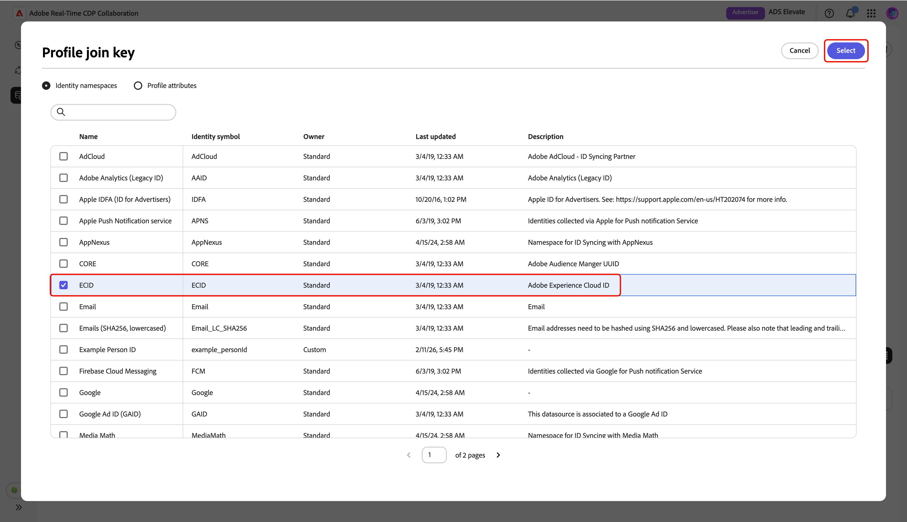

# Gestire le connessioni dati di misurazione

{{limited-availability-release-note}}

## Panoramica

Utilizza le connessioni dati di misurazione in Real-Time CDP Collaboration per originare i dati di conversione da varie piattaforme. Scopri come gestire i dettagli e le chiavi di corrispondenza per le connessioni dati esistenti.

## Visualizzare le connessioni dati di misurazione {#view-measurement-data-connections}

Puoi visualizzare i dettagli di qualsiasi connessione dati di misurazione esistente, tra cui il modo in cui vengono originati i dati di conversione, le chiavi corrispondenti in uso e tutti gli eventi di conversione collegati alla connessione.

Dall&#39;area di lavoro **[!UICONTROL Setup]**, passare alla scheda **[!UICONTROL Le mie connessioni dati]**. Tutte le connessioni dati di misurazione correnti vengono visualizzate nella sezione **[!UICONTROL Misurazione]** in visualizzazione tabulare o griglia. Selezionare **[!UICONTROL Visualizza connessione dati]** nella scheda di connessione corrispondente oppure selezionare il nome della connessione dati in visualizzazione tabella per aprire l&#39;area di lavoro e visualizzare tutti i dettagli.

{zoomable="yes"}

### Dettagli della connessione dati di misurazione {#measurement-data-connection-details}

In questa sezione sono disponibili i seguenti dettagli della connessione dati:

| Campo | Descrizione |
|-------------------|-------------|
| Stato | Lo stato corrente della connessione dati di misurazione, ad esempio **[!UICONTROL Attivo]**. |
| Origine | La piattaforma o il sistema che fornisce i dati di misurazione per questa connessione. |
| Sandbox | Il nome della sandbox in cui è configurata la connessione dati per la misurazione. |
| Set di dati | Nome del set di dati utilizzato per la determinazione origine dei dati di misurazione nella connessione. |
| Ultimo aggiornamento | Il timestamp dell’aggiornamento più recente della connessione dati per la misurazione. |
| Ultimo aggiornamento di | L&#39;ultimo utente che ha modificato la connessione dati di misurazione. |
| Creato | La marca temporale in cui è stata creata la connessione dati per la misurazione. |
| Creato da | Utente che ha creato originariamente la connessione dati per la misurazione. |

{style="table-layout:auto"}

### Chiavi di corrispondenza {#match-keys}

Le chiavi di corrispondenza sono i campi di destinazione a cui hai mappato i campi di origine quando [hai originato i dati di misurazione](./onboard-measurement-data.md). Per ulteriori informazioni sul funzionamento delle chiavi di corrispondenza, consulta la guida [chiavi di corrispondenza](./onboard-account.md#set-up-match-keys).

{zoomable="yes"}

### Eventi di conversione {#conversion-events}

Nella parte inferiore dell’area di lavoro viene visualizzato un elenco di eventi di conversione associati alla connessione dati. Nell&#39;elenco viene visualizzata una breve panoramica di ogni evento, con il relativo stato, tipo di conversione e origine. È possibile selezionare il nome dell&#39;evento per visualizzarne e modificarne le configurazioni oppure rimuovere l&#39;evento di conversione con l&#39;opzione di eliminazione (). Per una guida completa sulla gestione di un evento di conversione, consulta la guida [aggiungi e gestisci dati di misurazione](./onboard-measurement-data.md).

{zoomable="yes"}

## Modifica connessione dati di misurazione {#edit-measurement-data-connection}

Puoi aggiornare i dettagli e le chiavi di corrispondenza di una connessione dati di misurazione esistente in qualsiasi momento per garantire la precisione dei rapporti e dell’analisi. Per iniziare, passare alla scheda **[!UICONTROL Le mie connessioni dati]** e selezionare la connessione dati di misurazione che si desidera modificare. Verrà aperta l&#39;area di lavoro connessione dati, in cui è possibile eseguire i passaggi seguenti per apportare le modifiche necessarie.

### Modifica nome e descrizione {#edit-name-and-description}

Per aggiornare il nome e la descrizione della connessione dati, selezionare l&#39;icona di modifica () accanto al nome della connessione corrente.

{zoomable="yes"}

Nella finestra di dialogo **[!UICONTROL Modifica connessione dati]**, aggiorna i campi con i valori desiderati, quindi seleziona **[!UICONTROL Salva]** per applicare le modifiche.

{zoomable="yes"}

Viene visualizzata una finestra di dialogo di conferma per confermare che i dettagli sono stati aggiornati correttamente.

### Modifica chiavi di corrispondenza {#edit-match-keys}

>[!IMPORTANT]
>
>Prima di modificare le chiavi di corrispondenza per una connessione dati, tieni presente quanto segue:
>
>* Per le connessioni dati è possibile utilizzare solo le chiavi di corrispondenza configurate per il tuo account.
>* Al momento, è possibile aggiungere altre chiavi di corrispondenza a una connessione dati, ma una volta abilitata, una chiave di corrispondenza non può essere rimossa.

Nell&#39;area di lavoro connessione dati, selezionare **[!UICONTROL Modifica]** nel pannello **[!UICONTROL Corrispondenza chiavi]**.

{zoomable="yes"}

Viene visualizzata una finestra di dialogo di conferma in cui viene spiegato che eventuali modifiche alla connessione dati verranno applicate a tutte le conversioni associate. Seleziona **[!UICONTROL OK]** per confermare. Puoi scegliere di saltare questa conferma in futuro.

{zoomable="yes"}

Nella finestra di dialogo **[!UICONTROL Corrispondenza chiavi]**, puoi rivedere le impostazioni di arricchimento e visualizzare le mappature correnti tra i campi di origine e i campi di destinazione (chiavi di corrispondenza).

{zoomable="yes"}

#### Arricchimento {#enrichment}

Se l&#39;arricchimento non è stato abilitato quando [hai originato i dati di misurazione](./onboard-measurement-data.md), puoi arricchire il set di dati dell&#39;evento con gli attributi di Real-Time Customer Profile. Una volta attivato l’arricchimento per i dati di misurazione, non può essere disattivato. Puoi comunque aggiornare le chiavi di unione per l’arricchimento in base alle esigenze.

Quando abiliti l&#39;arricchimento nella finestra di dialogo **[!UICONTROL Corrispondenza chiavi]**, l&#39;interfaccia utente si espande per visualizzare altre opzioni di configurazione nella sezione **[!UICONTROL Arricchisci i dati dell&#39;evento con ID dai profili]**.

Selezionare l&#39;opzione **[!UICONTROL Chiave di unione campi di Source]**.

{zoomable="yes"}

Nella finestra di dialogo **[!UICONTROL Chiave di unione campo di Source]**, scegli il campo di origine, seguito da **[!UICONTROL Seleziona]**.

{zoomable="yes"}

Selezionare quindi l&#39;opzione **[!UICONTROL Chiave di aggiunta profilo]**. Nella finestra di dialogo **[!UICONTROL Chiave di aggiunta profilo]**, seleziona il campo del profilo dall&#39;elenco. Puoi utilizzare l’opzione Cerca per trovare il campo desiderato. Quindi, scegli **[!UICONTROL Seleziona]** per confermare.

{zoomable="yes"}

#### Modifica mappatura {#edit-mapping}

Per modificare una chiave di corrispondenza esistente, aggiornare il campo di origine e il campo di destinazione associati nella finestra di dialogo **[!UICONTROL Chiavi di corrispondenza]**. Se si desidera includere una nuova chiave di corrispondenza, selezionare **[!UICONTROL Aggiungi campo]**. In questo modo viene creata una riga vuota in cui è possibile definire una mappatura aggiuntiva tra i campi di origine e di destinazione.

{zoomable="yes"}

Quindi, seleziona il campo di origine vuoto. Viene visualizzata la finestra di dialogo **[!UICONTROL Seleziona campo di origine]** con un elenco dei campi di origine disponibili raggruppati in opzioni quali **[!UICONTROL Spazi dei nomi identità]** e **[!UICONTROL Attributi profilo]**. Puoi filtrare l’elenco e trovare il campo sorgente desiderato con l’opzione di ricerca.

Scegli il campo di origine desiderato, seguito da **[!UICONTROL Seleziona]**.

{zoomable="yes"}

Nella finestra di dialogo **[!UICONTROL Corrispondenza chiavi]**, utilizza il menu a discesa per mappare il nuovo campo di origine a un campo di destinazione. Tutti i campi di destinazione disponibili sono le chiavi di corrispondenza configurate per l&#39;account Collaborator. Se non trovi il campo di destinazione necessario, [modifica le chiavi di corrispondenza dell&#39;account](./onboard-account.md#edit-match-keys) per aggiungerlo.

Utilizzare l&#39;opzione **[!UICONTROL Applica trasformazione]** se si desidera impostare come origine di un campo senza hash un campo di destinazione con hash, ad esempio quando si esegue il mapping di un campo di origine telefono in testo normale al campo di destinazione **[!UICONTROL Telefono con hash]**.

{zoomable="yes"}

Dopo aver completato la mappatura dei campi, controlla gli aggiornamenti e seleziona **[!UICONTROL Conferma]** per applicare le modifiche.

{zoomable="yes"}

Una finestra di dialogo di conferma conferma conferma che i codici di corrispondenza sono stati aggiornati correttamente.

## Elimina connessione dati

Se si elimina una connessione dati, verranno rimosse tutte le conversioni sottostanti, le impostazioni associate e l’utilizzo in Collaboration. Questa azione non può essere annullata.

Per eliminare una connessione dati esistente, selezionare l&#39;icona Elimina () nell&#39;area di lavoro di una singola connessione dati.

{zoomable="yes"}

Viene visualizzata una finestra di dialogo di conferma. Seleziona **[!UICONTROL Elimina]** per completare l&#39;eliminazione della connessione dati.

{zoomable="yes"}

Una finestra di dialogo di conferma conferma conferma la corretta eliminazione della connessione dati.

## Passaggi successivi {#next-steps}

Dopo aver gestito le connessioni dati di misurazione, puoi:

* Aggiungi altri eventi di conversione collegati alla connessione dati in base alle esigenze. Per i passaggi dettagliati, consulta la documentazione [Aggiungi e gestisci dati di misurazione](./onboard-measurement-data.md).
* Genera rapporti di misurazione per ottenere informazioni approfondite sulle prestazioni e sull’impatto della campagna. Per ulteriori informazioni sui tipi di report disponibili e su come crearli, vedere la guida alle [misurazioni delle prestazioni](/help/guide/collaborate/measure.md).
