# Aggiungere e gestire i dati di misurazione {#add-and-manage-measurement-data}

>[!CONTEXTUALHELP]
>id="rtcdp_collaboration_onboard_measurement_data"
>title="Maggiori informazioni"
>abstract=""

>[!CONTEXTUALHELP]
>id="rtcdp_collaboration_measurement_data_target_fields"
>title="Campi di destinazione"
>abstract="Segnaposto per i campi di misurazione di destinazione."

>[!CONTEXTUALHELP]
>id="rtcdp_collaboration_measurement_data_source_fields"
>title="Campi origine"
>abstract="Segnaposto per i campi di misurazione di origine."

>[!CONTEXTUALHELP]
>id="rtcdp_collaboration_import_measurement_mapping_source_fields"
>title="Mappare i campi di origine"
>abstract="Segnaposto per la mappatura delle misurazioni dei campi di origine."

>[!CONTEXTUALHELP]
>id="rtcdp_collaboration_import_measurement_mapping_target_fields"
>title="Mappare i campi di destinazione"
>abstract="Segnaposto per la mappatura delle misurazioni dei campi di destinazione."

{{limited-availability-release-note}}

Questo documento illustra i passaggi per aggiungere i dati di misurazione della campagna all’Adobe Real-Time CDP Collaboration. Gli editori possono lavorare con i team di Adobe per caricare i dati di misurazione delle campagne. Dopo il caricamento e l&#39;elaborazione di tali dati, sia l&#39;editore che l&#39;inserzionista potranno visualizzare [rapporti di misurazione campagne](/help/guide/collaborate/measure.md) estesi.

## Aggiungi dati di misurazione {#add-measurement-data}

In qualità di inserzionista, puoi caricare in Collaboration i dati di misurazione contenenti gli eventi di conversione da utilizzare nei rapporti di misurazione delle campagne. I dati di conversione in genere includono campi come gli identificatori dell’utente (ad esempio, e-mail con hash o ID dispositivo), la marca temporale dell’evento di conversione e dettagli specifici dell’evento di conversione come l’acquisto o l’iscrizione.

Per generare i dati di misurazione, passare alla scheda **[!UICONTROL Dati di misurazione personali]** nell&#39;area di lavoro **[!UICONTROL Configurazione]**. Seleziona l&#39;icona Aggiungi () e quindi selezionare **[!UICONTROL Dati di misurazione]**.

Se si tratta dei primi dati di misurazione, è possibile selezionare anche l&#39;opzione **[!UICONTROL Aggiungi]**.

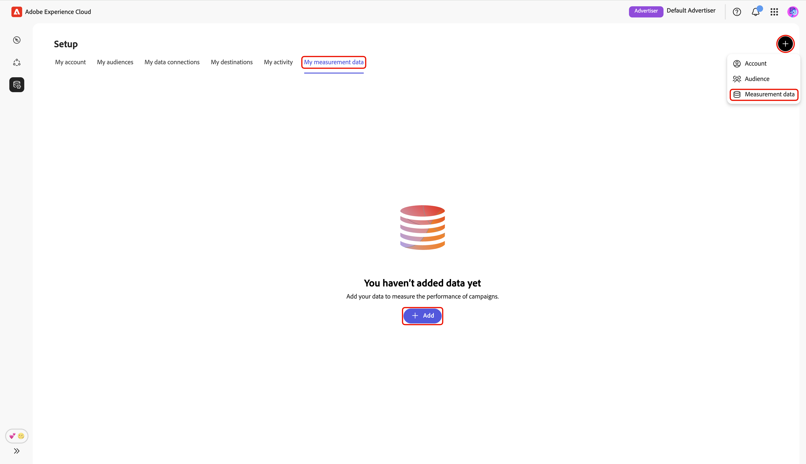{zoomable="yes"}

Viene visualizzata la schermata **[!UICONTROL Aggiungi dati di misurazione]**, in cui viene visualizzato un riepilogo dei passaggi per l&#39;origine dei dati di misurazione. Seleziona **[!UICONTROL Avvia onboarding]**.

{zoomable="yes"}

### Connessione dati e dettagli {#data-connection-and-details}

In questo passaggio, devi configurare la connessione dati e specificare i dettagli per i dati di misurazione.

#### Seleziona tipo di dati di misurazione {#select-measurement-data-type}

Il tipo di dati di misurazione definisce il tipo di eventi che inserisci per la misurazione delle campagne. Attualmente, i dati di conversione sono il tipo supportato.

Seleziona **[!UICONTROL Dati conversione]** come tipo di dati di misurazione, seguito da **[!UICONTROL Successivo]**.

{zoomable="yes"}

#### Selezionare la connessione dati {#select-data-connection}

Una connessione dati è l&#39;origine da cui vengono originati i dati di misurazione in Collaboration. Una volta stabilita la connessione dati iniziale e ottenuto il primo set di dati di misurazione, è possibile continuare a ottenere dati di misurazione aggiuntivi utilizzando la stessa connessione dati.

Per aggiungere una connessione dati, selezionare **[!UICONTROL Aggiungi una nuova connessione dati]**, quindi selezionare **[!UICONTROL Avanti]**.

{zoomable="yes"}

#### Seleziona origine dati {#select-data-source}

Scegliere quindi l&#39;origine della connessione dati. Al momento, Adobe Experience Platform è l’unica origine dati supportata.

Seleziona l&#39;origine dati, quindi seleziona **[!UICONTROL Successivo]**.

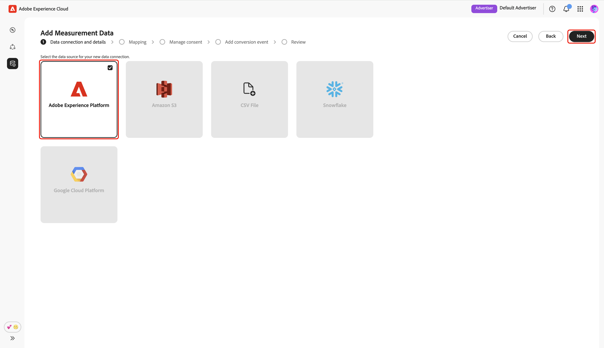{zoomable="yes"}

#### Seleziona sandbox {#select-sandbox}

Seleziona la sandbox che include i dati di misurazione che desideri utilizzare per i rapporti di misurazione delle campagne Collaboration. Scegli la sandbox dall&#39;elenco delle sandbox disponibili, quindi seleziona **[!UICONTROL Successivo]**.

{zoomable="yes"}

#### Seleziona set di dati di misurazione {#select-measurement-dataset}

Viene visualizzato un elenco di set di dati nella sandbox selezionata. Seleziona un set di dati come dati di misurazione, quindi seleziona **[!UICONTROL Successivo]**. Puoi utilizzare l’opzione Ricerca per filtrare e trovare il set di dati preferito.

{zoomable="yes"}

#### Fornisci nome e dettagli {#provide-name-and-details}

Quindi, fornisci un nome e una descrizione per la connessione dati. Queste informazioni ti aiuteranno a identificare la connessione dati in un secondo momento.

{zoomable="yes"}

### Mappatura {#mapping}

Il passaggio successivo consiste nel mappare i campi dai dati di misurazione ai campi di destinazione corrispondenti utilizzati in Collaboration. Puoi anche scegliere di arricchire il set di dati dell’evento con gli attributi di Real-Time Customer Profile mappando le chiavi di join e utilizzare questi attributi per suddividere i rapporti di misurazione.

#### Arricchire i dati dell’evento {#enrich-event-data}

Per arricchire i dati dell&#39;evento, seleziona l&#39;opzione **[!UICONTROL Chiave di unione campo di Source]**.

{zoomable="yes"}

Nella finestra di dialogo **[!UICONTROL Chiave di unione campo di Source]**, scegli il campo di origine, seguito da **[!UICONTROL Seleziona]**.

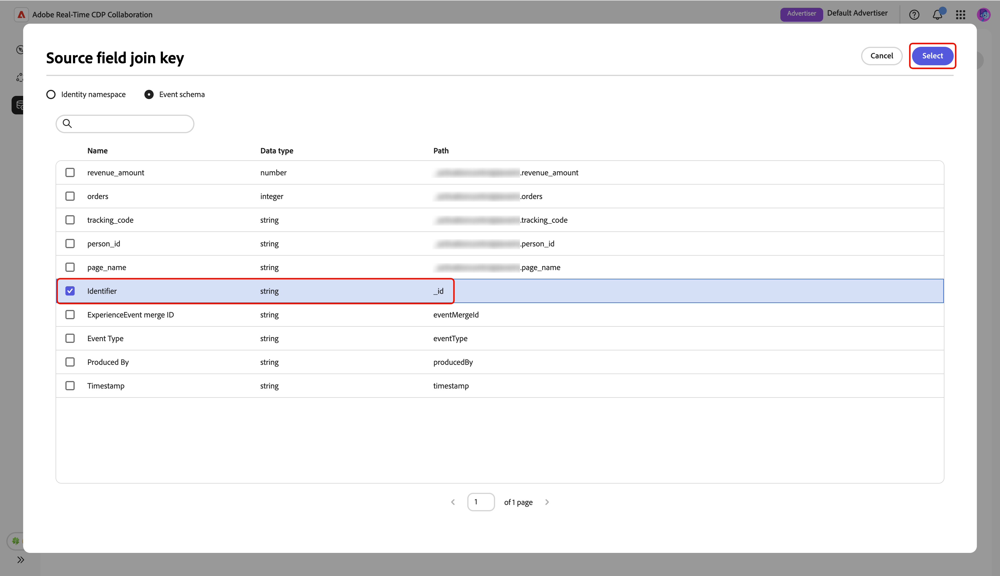{zoomable="yes"}

Selezionare quindi l&#39;opzione **[!UICONTROL Chiave di aggiunta profilo]**. Nella finestra di dialogo **[!UICONTROL Chiave di aggiunta profilo]**, seleziona il campo del profilo dall&#39;elenco. Puoi utilizzare l’opzione Cerca per trovare il campo desiderato. Quindi, scegli **[!UICONTROL Seleziona]** per confermare.

{zoomable="yes"}

#### Mappatura dei campi {#mapping-fields}

Per iniziare a mappare i campi sorgente dai dati di misurazione ai campi di destinazione in Collaboration, seleziona il campo sorgente vuoto nella schermata **[!UICONTROL Mapping]**.

{zoomable="yes"}

Viene visualizzata la finestra di dialogo **[!UICONTROL Seleziona campo di origine]**, in cui viene visualizzato un elenco dei campi di origine disponibili raggruppati in opzioni quali **[!UICONTROL Spazio dei nomi identità]** e **[!UICONTROL Schema evento]**. Puoi utilizzare l’opzione di ricerca per filtrare e trovare il campo di origine dall’elenco.

Scegli il campo di origine desiderato, seguito da **[!UICONTROL Seleziona]**.

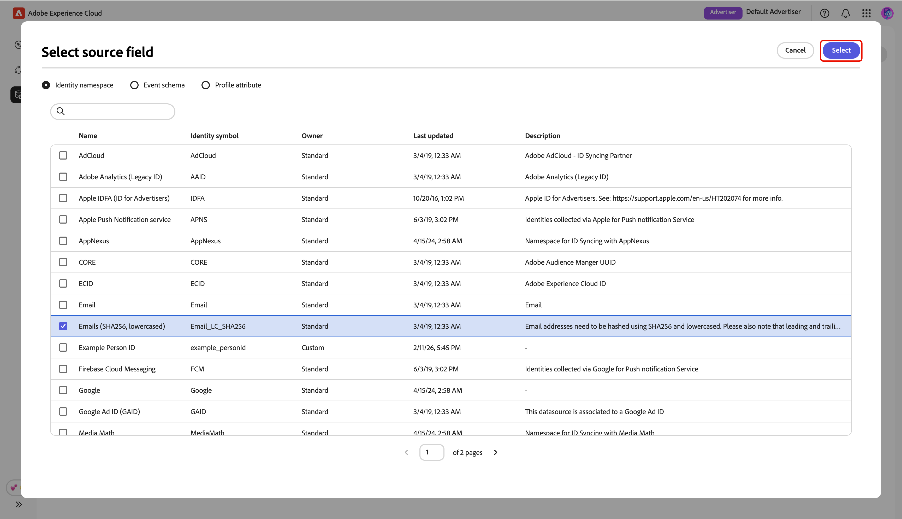{zoomable="yes"}

Quindi, utilizza il menu a discesa per mappare il campo sorgente selezionato su un campo di destinazione appropriato. Tutti i campi di destinazione disponibili sono le [chiavi di corrispondenza configurate per l&#39;account Collaborator](./onboard-account.md#set-up-match-keys).

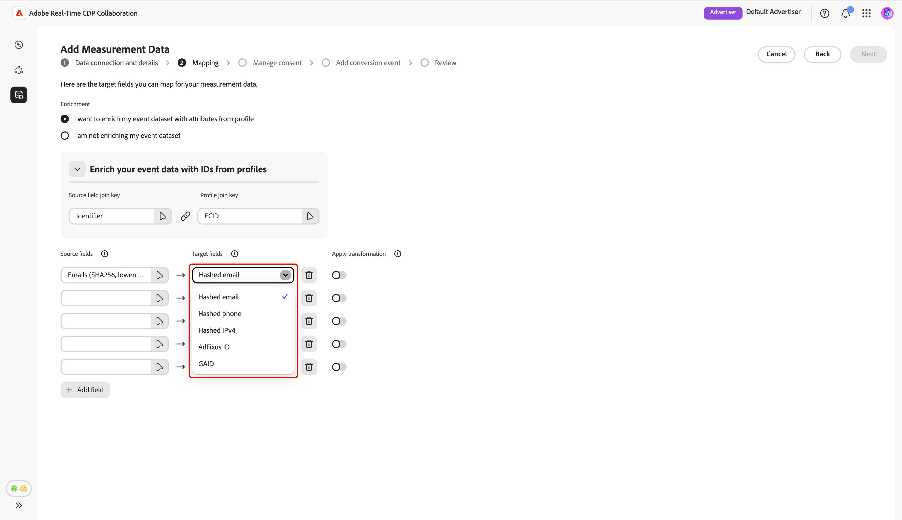{zoomable="yes"}

Puoi aggiungere o rimuovere le righe di mappatura in base alle esigenze. Se devi mappare un campo di origine senza hash a un campo di destinazione con hash (ad esempio, mappando un&#39;e-mail in testo normale a [!UICONTROL E-mail con hash]), utilizza l&#39;opzione **[!UICONTROL Applica trasformazione]** per applicare l&#39;hashing richiesto.

Al termine, controlla i campi mappati e le chiavi di unione se l’arricchimento è abilitato. Quindi, seleziona **[!UICONTROL Avanti]**.

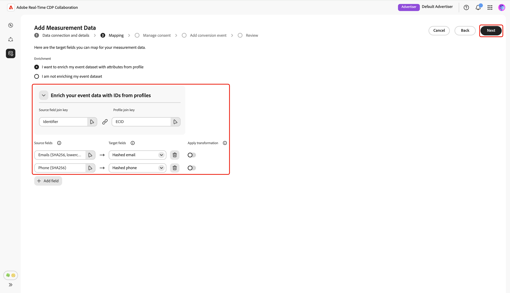{zoomable="yes"}

### Gestire il consenso {#manage-consent}

Prima di procedere, è necessario riconoscere che l’utilizzo dei dati in Collaboration è conforme ai criteri di governance dei dati di Real-Time CDP. Tutti i dati devono essere prefiltrati in base ai requisiti del consenso o a qualsiasi criterio di consenso personalizzato applicabile, quindi non è richiesto alcun ulteriore trattamento.

Per confermare la conferma, seleziona **[!UICONTROL Avanti]**.

{zoomable="yes"}

Se [abiliti l&#39;arricchimento del profilo durante il passaggio di mappatura](#enrich-event-data), puoi configurare i criteri di consenso da un elenco di opzioni predefinite. Ciò include:

* **Azioni di marketing**: utilizza queste azioni di marketing per controllare quali dati del pubblico inserire in Collaboration da Experience Platform.
* **Regole di consenso**: seleziona le regole di consenso da applicare ai dati originati in Collaboration.
* **Pubblico**: utilizza il filtro del pubblico per includere o escludere i profili di pubblico per il consenso.

>[!NOTE]
>
>**[!UICONTROL Data Collaboration]** supporta le etichette di utilizzo dei dati C4, C5 e C9, mentre **[!UICONTROL Data Science]** supporta solo C9. Ulteriori informazioni sulle etichette di utilizzo dei dati nella documentazione di Experience Platform:
>
>* [Panoramica delle etichette di utilizzo dei dati](https://experienceleague.adobe.com/it/docs/experience-platform/data-governance/labels/overview){target="_blank"}
>* [Glossario](https://experienceleague.adobe.com/it/docs/experience-platform/data-governance/labels/reference){target="_blank"}

Seleziona le impostazioni preferite, quindi seleziona **[!UICONTROL Successivo]**.

{zoomable="yes"}

Prima di procedere, devi confermare e accettare i termini nella finestra di dialogo **[!UICONTROL Criteri di governance e azioni di applicazione]**. Selezionare la casella di controllo, seguita da **[!UICONTROL OK]**.

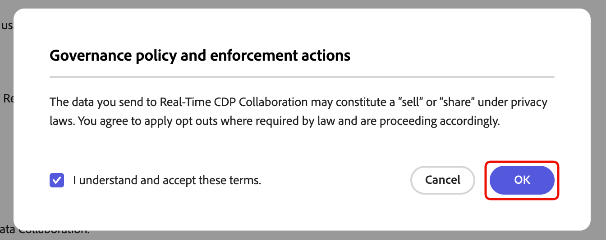{zoomable="yes"}

#### Filtro del pubblico {#audience-filter}

Per includere o escludere alcuni profili di pubblico per il consenso, utilizza il menu a discesa **[!UICONTROL Filtro pubblico]**. Dopo aver selezionato questo filtro, l&#39;interfaccia utente si aggiorna per visualizzare l&#39;opzione **[!UICONTROL Sfoglia pubblico]**. Seleziona **[!UICONTROL Sfoglia pubblico]**.

{zoomable="yes"}

Viene visualizzata la finestra di dialogo **[!UICONTROL Seleziona pubblico]**. Scegli un pubblico dall&#39;elenco, seguito da **[!UICONTROL Seleziona]**.

{zoomable="yes"}

Ora viene visualizzato il pubblico scelto, con l’opzione di rimuoverlo se necessario. Rivedi le impostazioni di consenso, quindi seleziona **[!UICONTROL Successivo]**.

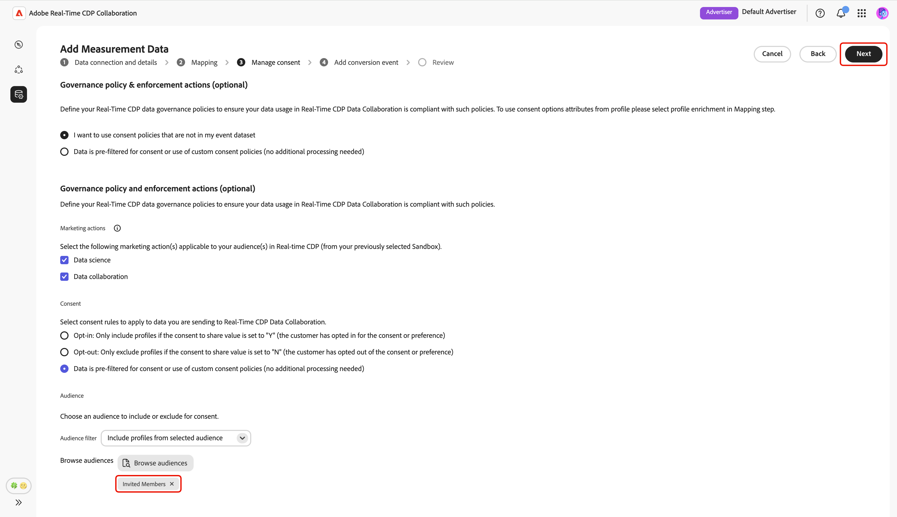{zoomable="yes"}

### Aggiunta evento di conversione {#add-conversion-event}

Quindi, definisci gli eventi di conversione che desideri misurare l’impatto delle campagne su, ad esempio, visite al sito, registrazioni o acquisti completati. È possibile specificare fino a **3** eventi di conversione distinti per la misurazione.

Immetti il nome dell’evento di conversione, quindi utilizza il menu a discesa per selezionare il tipo di conversione.

{zoomable="yes"}

È possibile immettere un valore per la conversione oppure lasciarlo vuoto se non si desidera assegnare un valore in questo momento.

{zoomable="yes"}

Successivamente, devi specificare la chiave di duplicazione per indicare quali righe nel set di dati dell’evento appartengono allo stesso evento di conversione sottostante (ad esempio, lo stesso timestamp durante un processo di iscrizione). Questo impedisce di contare la stessa conversione più volte nei rapporti di misurazione. A tale scopo, selezionare **[!UICONTROL Chiave di duplicazione]**. Nella finestra di dialogo **[!UICONTROL Chiave di duplicazione]**, individua e scegli la chiave, seguita da **[!UICONTROL Seleziona]**.

{zoomable="yes"}

Dopo aver specificato la chiave di duplicazione, puoi aggiungere fino a **5** condizioni per includere solo le righe pertinenti del set di dati dell&#39;evento per la conversione. Scegli di applicare tutte o una qualsiasi di queste condizioni.

Seleziona **[!UICONTROL Aggiungi condizione]**, quindi seleziona l&#39;opzione della condizione.

{zoomable="yes"}

Nella finestra di dialogo **[!UICONTROL Seleziona campo di origine]**, individua e scegli un campo di origine per la regola della condizione, seguito da **[!UICONTROL Seleziona]**.

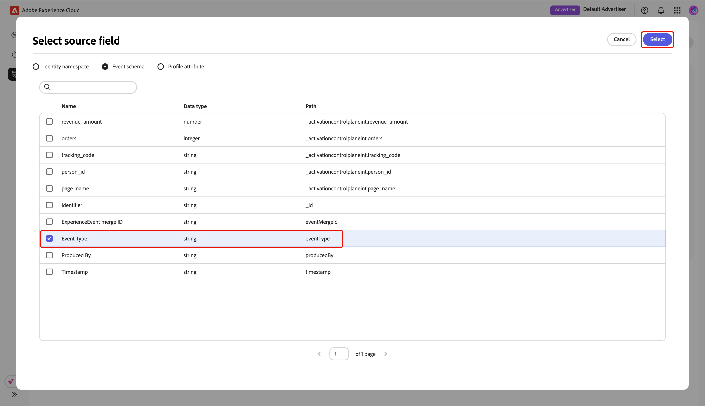{zoomable="yes"}

Utilizza il menu a discesa per selezionare un operatore logico, quindi inserisci il valore per la regola di conversione.

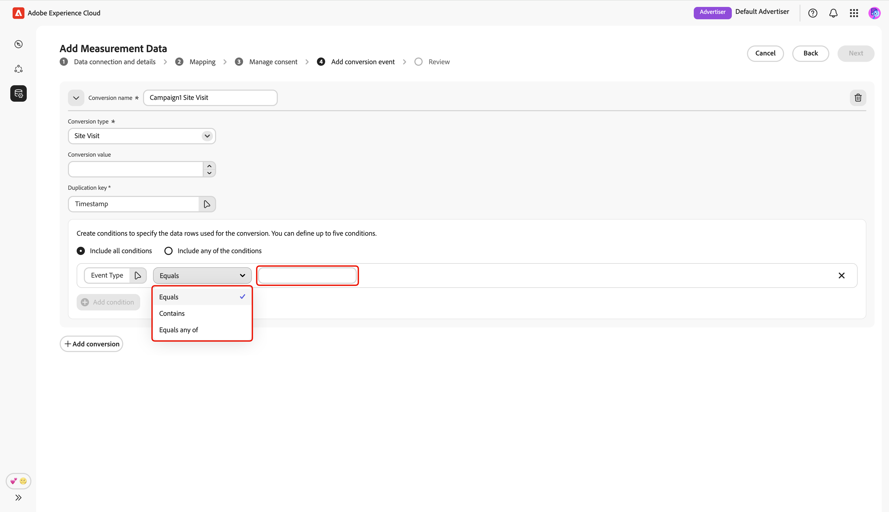{zoomable="yes"}

Per aggiungere un altro evento di conversione, selezionare **[!UICONTROL Aggiungi conversione]**. È possibile includere fino a **3** eventi di conversione in totale. Al termine, rivedi le configurazioni di conversione e seleziona **[!UICONTROL Avanti]**.

{zoomable="yes"}

### Rivedi {#review}

Viene visualizzata la schermata **[!UICONTROL Rivedi]** con un riepilogo delle impostazioni dei dati di misurazione. Rivedi e assicurati che tutte le informazioni siano corrette. Se devi modificare una sezione, usa l&#39;opzione **[!UICONTROL Modifica]**.

Infine, seleziona **[!UICONTROL Completa]** per completare l&#39;aggiunta dei dati di misurazione.

{zoomable="yes"}

Una finestra di dialogo di conferma conferma conferma che i dati di misurazione sono stati creati correttamente. Puoi visualizzare i nuovi eventi di conversione configurati dai dati di misurazione nell&#39;area di lavoro **[!UICONTROL Dati di misurazione personali]**.

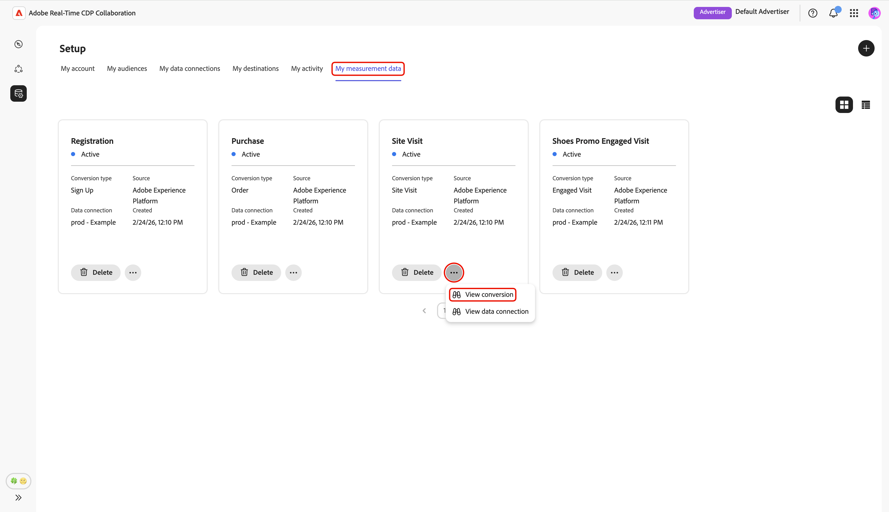{zoomable="yes"}

In visualizzazione griglia o tabella, selezionare un elemento riga o l&#39;opzione **[!UICONTROL Visualizza conversione]** in una scheda evento per visualizzare una panoramica di un evento di conversione specifico. Visualizza lo stato dell’evento, l’origine e il nome della connessione dati, insieme a pannelli dettagliati per:

* **[!UICONTROL Dettagli conversione]**: visualizza informazioni chiave sulla conversione, tra cui il tipo, la chiave di duplicazione utilizzata per identificare eventi univoci e il valore di conversione assegnato (se specificato).
* **[!UICONTROL Condizioni]**: visualizza le regole di condizione applicate a questo evento di conversione.

{zoomable="yes"}

## Modificare i dati di misurazione {#edit-measurement-data}

Dopo aver determinato l’origine dei dati di misurazione, puoi modificare i dettagli e le regole di condizione di un evento di conversione in qualsiasi momento.

Dalla scheda **[!UICONTROL Dati di misurazione personali]**, seleziona l&#39;opzione con puntini di sospensione () nella scheda evento di conversione pertinente. Quindi seleziona **[!UICONTROL Visualizza conversione]** dal menu a discesa per aprire la pagina dettagliata per l&#39;evento di conversione.

{zoomable="yes"}

### Modifica nome e descrizione {#edit-name-and-description}

Per aggiornare il nome e la descrizione dell&#39;evento, seleziona l&#39;icona Modifica () in alto a destra della pagina.

{zoomable="yes"}

Nella finestra di dialogo **[!UICONTROL Modifica nome e descrizione]**, aggiorna i campi con i valori desiderati, quindi seleziona **[!UICONTROL Salva]** per applicare le modifiche.

{zoomable="yes"}

Viene visualizzata una finestra di dialogo di conferma per confermare che i dettagli sono stati aggiornati correttamente.

### Modifica dettagli conversione {#edit-conversion-details}

Puoi aggiornare i seguenti dettagli di conversione dell’evento:

| Campo | Descrizione |
|-------------------|-------------|
| Tipo di conversione | La categoria dell’evento di conversione, ad esempio visita al sito, acquisto o iscrizione. |
| Chiave di duplicazione | Identificatore per le righe nel set di dati dell’evento che appartengono allo stesso evento di conversione (ad esempio, stessa marca temporale). Impedisce conteggi duplicati. |
| Valore di conversione | Il valore associato a ogni conversione. |

{style="table-layout:auto"}

Per iniziare a modificare, seleziona **[!UICONTROL Modifica]** nel pannello **[!UICONTROL Dettagli conversione]**.

{zoomable="yes"}

Nella finestra di dialogo **[!UICONTROL Modifica dettagli conversione]**, utilizza il menu a discesa per aggiornare il tipo di conversione. È possibile immettere un valore per la conversione oppure lasciarlo vuoto se non si desidera assegnare un valore. Per modificare la chiave di duplicazione, seleziona l’opzione chiave esistente.

{zoomable="yes"}

La finestra di dialogo **[!UICONTROL Chiave duplicata]** visualizza un elenco di campi disponibili raggruppati in opzioni quali **[!UICONTROL Spazio dei nomi identità]** e **[!UICONTROL Schema evento]**. Trova e scegli la chiave desiderata, seguita da **[!UICONTROL Seleziona]**.

{zoomable="yes"}

Al termine, controlla gli aggiornamenti e seleziona **[!UICONTROL Salva]** per applicare le modifiche.

{zoomable="yes"}

Viene visualizzata una finestra di dialogo di conferma per confermare che i dettagli sono stati aggiornati correttamente.

### Modificare le condizioni {#edit-conditions}

Le regole di condizione specificano quali righe di dati del set di dati evento vengono incluse come conversioni. Aggiorna queste regole in base alle esigenze affinché la misurazione rifletta solo i dati più rilevanti per l’analisi.

Per modificare le condizioni, seleziona **[!UICONTROL Modifica]** nel pannello **[!UICONTROL Condizioni]**.

{zoomable="yes"}

Nella finestra di dialogo **[!UICONTROL Modifica regole di conversione]** puoi visualizzare i dettagli correnti di tutte le condizioni. Seleziona un’opzione di condizione esistente per aggiornarne i dettagli tra cui campo di origine, regola logica e valore.

{zoomable="yes"}

Per includere regole di conversione aggiuntive, selezionare **[!UICONTROL Aggiungi condizione]**. Quindi seleziona la nuova opzione di condizione vuota.

{zoomable="yes"}

Nella finestra di dialogo **[!UICONTROL Seleziona campo di origine]**, puoi visualizzare i campi disponibili raggruppati in opzioni quali **[!UICONTROL Spazio dei nomi identità]** e **[!UICONTROL Schema evento]**. Seleziona il campo appropriato da utilizzare per la condizione, quindi scegli **[!UICONTROL Seleziona]**. Puoi usare l&#39;opzione **[!UICONTROL Cerca]** per trovare rapidamente il campo preferito.

{zoomable="yes"}

Quindi, utilizza il menu a discesa per selezionare un operatore logico dall’elenco disponibile e immettere un valore per la condizione.

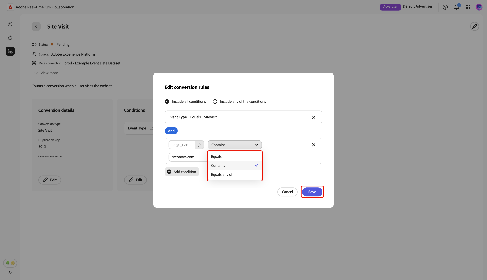{zoomable="yes"}

Utilizzare **[!UICONTROL Includi tutte le condizioni]** se tutte le condizioni specificate sono necessarie per ogni conversione oppure **[!UICONTROL Includi una delle condizioni]** per consentire le conversioni che corrispondono ad almeno una condizione. Al termine dell&#39;aggiornamento, rivedere e selezionare **[!UICONTROL Salva]** per applicare le modifiche.

{zoomable="yes"}

Viene visualizzata una finestra di dialogo di conferma per confermare che i dettagli sono stati aggiornati correttamente.

## Eliminare i dati di misurazione {#delete-measurement-data}

L’eliminazione dei dati di misurazione rimuove definitivamente dal progetto l’evento di conversione associato e tutti i dettagli di misurazione collegati. I rapporti di misurazione che si basano su questo evento perderanno le metriche di conversione corrispondenti e non potranno più essere aggiornati. Questa azione non può essere annullata.

Per eliminare un evento di conversione esistente, passare alla scheda **[!UICONTROL Dati di misurazione personali]** nell&#39;area di lavoro **[!UICONTROL Configurazione]**. Nella visualizzazione griglia, selezionare **[!UICONTROL Elimina]** nella scheda eventi corrispondente. Nella vista tabella, selezionare l&#39;icona Elimina () accanto al nome dell&#39;evento.

{zoomable="yes"}

Viene visualizzata la finestra di dialogo **[!UICONTROL Elimina misurazione]**, in cui viene richiesto di confermare l&#39;eliminazione dell&#39;evento. Seleziona **[!UICONTROL Elimina]**.

{zoomable="yes"}

Viene visualizzata una finestra di dialogo di conferma per confermare che l’evento di conversione è stato eliminato correttamente.

## Passaggi successivi {#next-steps}

Acquisizione dei dati di misurazione in Collaboration completata. In qualità di inserzionista, ora puoi creare rapporti di attribuzione per esplorare come le campagne guidano le conversioni e misurare l’impatto complessivo. Se sei un editore, richiedi al tuo collaboratore di generare un rapporto di attribuzione per le campagne. Per istruzioni dettagliate, consulta la guida [Crea rapporto di attribuzione](../collaborate/measure.md#create-attribution-report).
