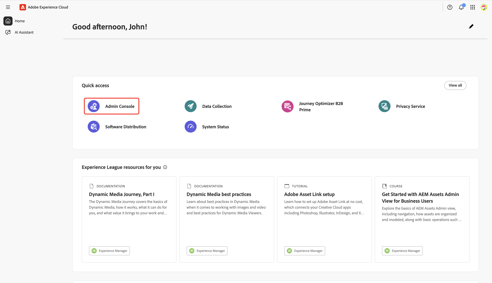
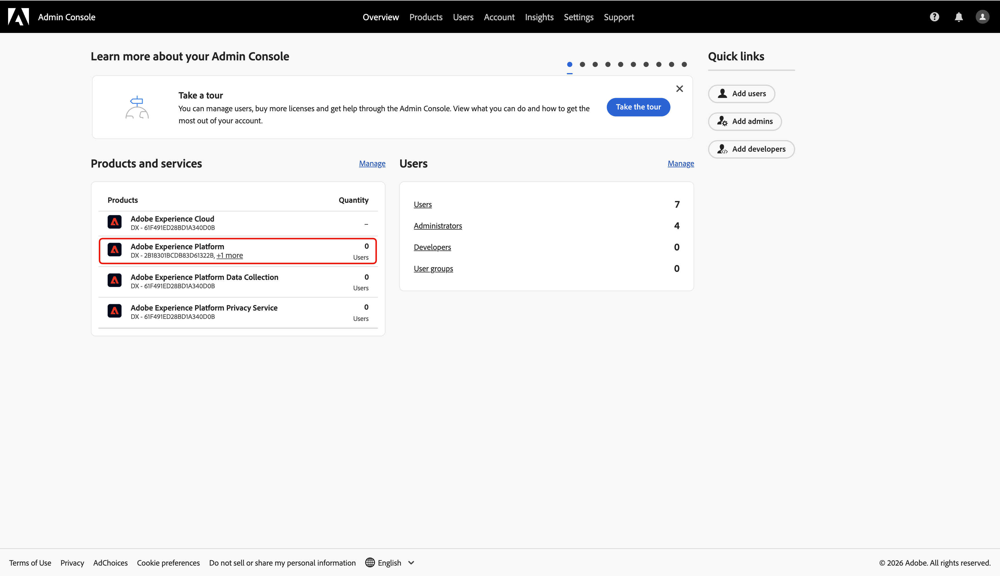
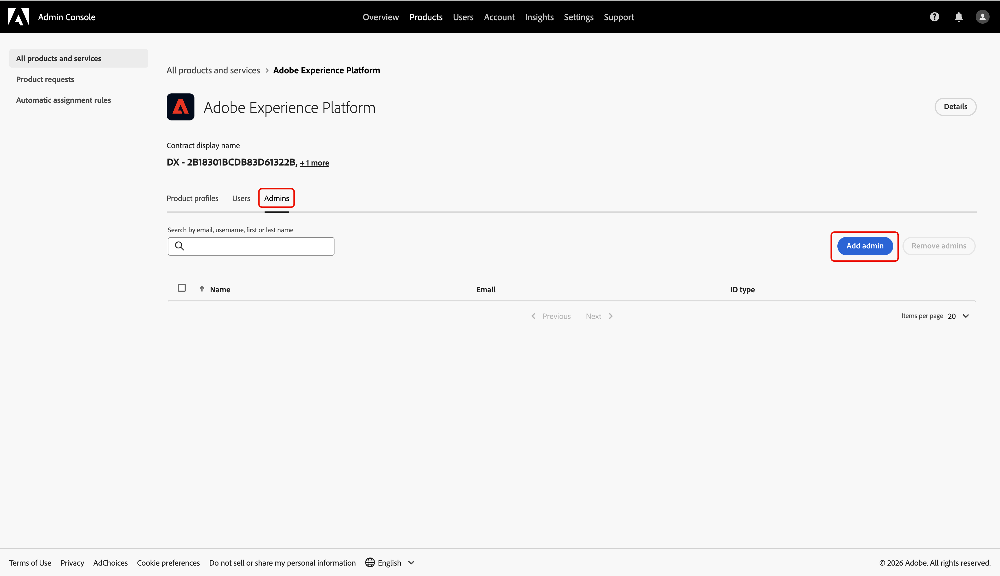
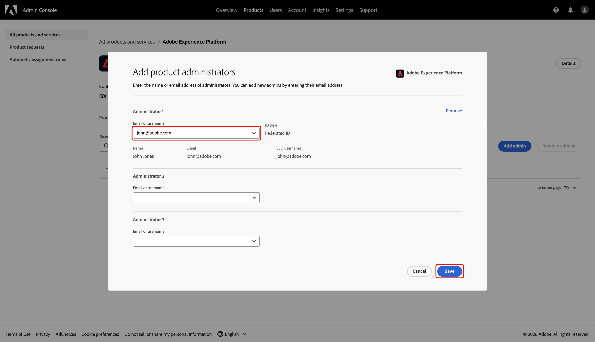
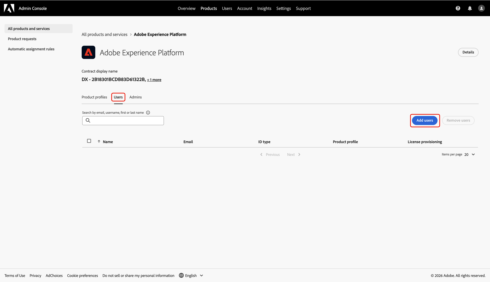
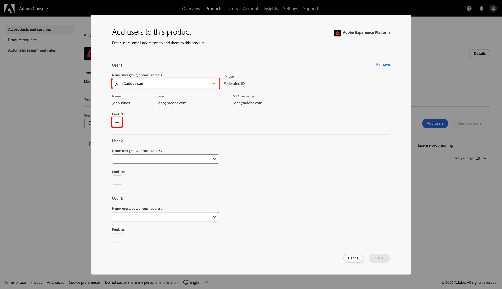
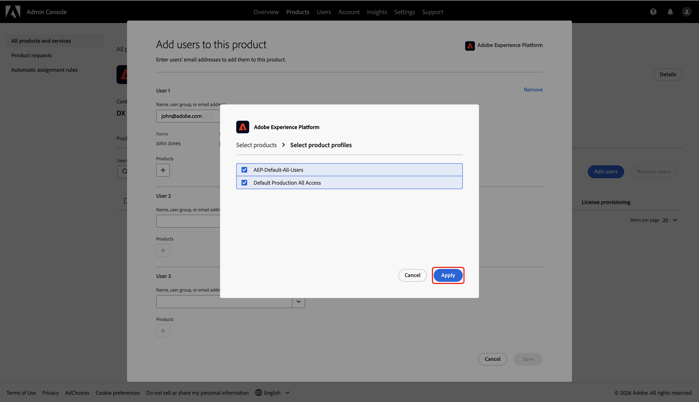
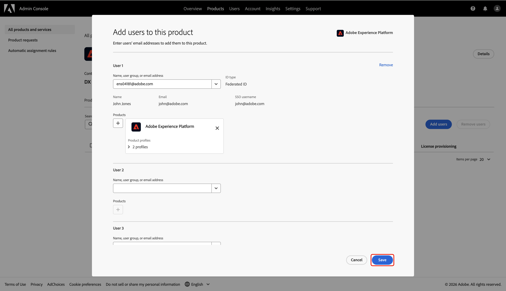
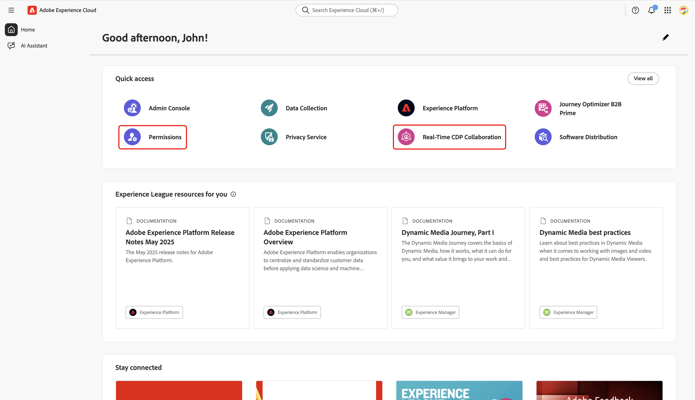

# Configura l&#39;accesso amministratore per l&#39;onboarding di Collaboration [!DNL Starter]

In qualità di primo utente della tua organizzazione ad accedere a Adobe Experience Platform tramite Collaboration [!DNL Starter], sei responsabile della configurazione e della gestione dell&#39;accesso per il tuo team. Per iniziare a lavorare in Real-Time CDP Collaboration, devi concederti le autorizzazioni di amministratore e utente necessarie. Leggi questa guida per scoprire come configurare l’accesso richiesto in Admin Console in modo da poter gestire le autorizzazioni per le collaborazioni nell’interfaccia Autorizzazioni.

## Prerequisiti {#prerequisites}

Prima di continuare, assicurati di disporre di:

* Ha accettato l&#39;invito del partner Collaboration. Per ulteriori informazioni sui requisiti dell&#39;invito, vedere [Collaboration [!DNL Starter] overview](../overview/starter-overview.md#prerequisites).
* Ha rivisto e firmato i termini e le condizioni di Collaboration.
* Hai ricevuto l’e-mail di benvenuto di Adobe e completato la creazione del tuo primo account.

## Configurare l’accesso {#setup-access}

Quando l&#39;account Adobe viene creato tramite il flusso di lavoro [!DNL Starter], viene assegnato automaticamente il ruolo di amministratore di sistema. Questo consente di gestire gli utenti e l’accesso ai prodotti in Admin Console. Tuttavia, non si dispone ancora dell&#39;accesso a **[!UICONTROL Autorizzazioni]**, necessario per gestire l&#39;accesso per Collaboration.

Utilizza Admin Console per concederti sia l&#39;**accesso amministratore prodotto** ad Experience Platform che l&#39;**accesso utente** ai prodotti Experience Platform per accedere alle **[!UICONTROL autorizzazioni]**.

Per ulteriori informazioni su ruoli e prodotti in Experience Cloud, consulta la [panoramica sul controllo degli accessi](../permissions/overview.md).

>[!TIP]
>
>In questa guida, un **amministratore** farà riferimento a **amministratori di sistema e di prodotto**.

### Configurare l’accesso come amministratore del prodotto {#configure-product-admin-access}

Leggere questa sezione per concedere a se stessi i privilegi di amministratore per avviare la configurazione dell&#39;accesso per Collaboration [!DNL Starter].

#### Accedere ad Admin Console {#access-admin-console}

Per iniziare, accedi ad [Adobe Experience Cloud](https://experience.adobe.com/){target="_blank"} con le tue credenziali. Puoi visualizzare un elenco dei prodotti disponibili nella sezione **[!UICONTROL Accesso rapido]**. Seleziona **[!UICONTROL Admin Console]**.

{zoomable="yes"}

#### Accedere al dashboard di prodotto di Adobe Experience Platform {#access-adobe-experience-platform}

L&#39;area di lavoro [Admin Console](https://adminconsole.adobe.com/) verrà aperta in una nuova scheda. Selezionare **[!UICONTROL Adobe Experience Platform]** dall&#39;elenco **[!UICONTROL Prodotti]** in **[!UICONTROL Prodotti e servizi]**.

{zoomable="yes"}

#### Aggiungi amministratore prodotto {#add-product-admin}

Nel dashboard del prodotto **[!UICONTROL Adobe Experience Platform]**, passa alla scheda **[!UICONTROL Amministratori]**. Quindi seleziona **[!UICONTROL Aggiungi amministratore]**.

{zoomable="yes"}

Immetti il tuo indirizzo e-mail o nome utente nella finestra di dialogo **[!UICONTROL Aggiungi amministratori di prodotto]**, quindi seleziona l&#39;account corretto dal menu a discesa. Al termine, seleziona **[!UICONTROL Salva]**.

{zoomable="yes"}

Ora sei un amministratore di prodotto e puoi aggiungere utenti o altri amministratori al prodotto all’interno di Admin Console. Quindi, concedi all’utente l’accesso al prodotto Experience Platform per accedere ed eseguire funzioni in Autorizzazioni.

### Configurare l’accesso utente {#configure-user-access}

Per gestire le autorizzazioni di Collaboration, devi disporre dell&#39;**accesso utente** al prodotto oltre all&#39;accesso come amministratore. L’accesso utente può essere configurato da un amministratore di sistema o di prodotto.

>[!TIP]
>
>Se segui quanto riportato nella sezione precedente, dovresti essere già nel dashboard del prodotto **[!UICONTROL Adobe Experience Platform]** all&#39;interno di Admin Console. Da qui, passare a [aggiungi te stesso/a come utente](#add-user).

La procedura seguente illustra come iniziare a configurare l’accesso utente:

1. [Accedi ad Admin Console dalla home page di Adobe Experience Cloud](#access-admin-console).
2. [Passare alla dashboard del prodotto Adobe Experience Platform](#access-adobe-experience-platform).

#### Aggiungi utente al prodotto {#add-user}

Ora sei nel dashboard prodotto **[!UICONTROL Adobe Experience Platform]**. Passa alla scheda **[!UICONTROL Utenti]**, quindi seleziona **[!UICONTROL Aggiungi utenti]**.

{zoomable="yes"}

Viene visualizzata la finestra di dialogo **[!UICONTROL Aggiungi utenti a questo prodotto]**, in cui viene richiesto di immettere il nome, il gruppo di utenti o l&#39;indirizzo e-mail. Inserisci i valori, quindi seleziona l’account dall’elenco a discesa.

{zoomable="yes"}

Quindi, seleziona l&#39;icona Aggiungi  in **[!UICONTROL Prodotti]**.

Viene visualizzata una finestra di dialogo con un elenco di [profili di prodotto](https://helpx.adobe.com/it/enterprise/using/manage-product-profiles.html) disponibili. Selezionare **[!UICONTROL AEP-Default-All-Users]** e **[!UICONTROL Default Production All Access]**. Quindi selezionare **[!UICONTROL Applica]**.

{zoomable="yes"}

Infine, seleziona **[!UICONTROL Salva]** per completare l&#39;aggiunta di un nuovo utente al prodotto.

{zoomable="yes"}

Dopo aver ottenuto l&#39;accesso come utente, torna a [Adobe Experience Cloud](https://experience.adobe.com/){target="_blank"}. Verificare che **[!UICONTROL Autorizzazioni]** e **[!UICONTROL Real-Time CDP Collaboration]** siano disponibili in **[!UICONTROL Accesso rapido]**.

{zoomable="yes"}

>[!TIP]
>
>Se **[!UICONTROL Autorizzazioni]** e **[!UICONTROL Real-Time CDP Collaboration]** non vengono visualizzati in **[!UICONTROL Accesso rapido]**, prova a disconnetterti e ad accedere di nuovo.

## Passaggi successivi {#next-steps}

Ora disponi sia di **accesso amministratore** che di **accesso utente** per immettere autorizzazioni in cui definire ruoli, assegnare autorizzazioni specifiche e gestire l&#39;accesso utente per le funzioni e le risorse di Collaboration. Per istruzioni dettagliate, fare riferimento alla [Guida ai controlli delle autorizzazioni](./starter-permission-controls.md).
