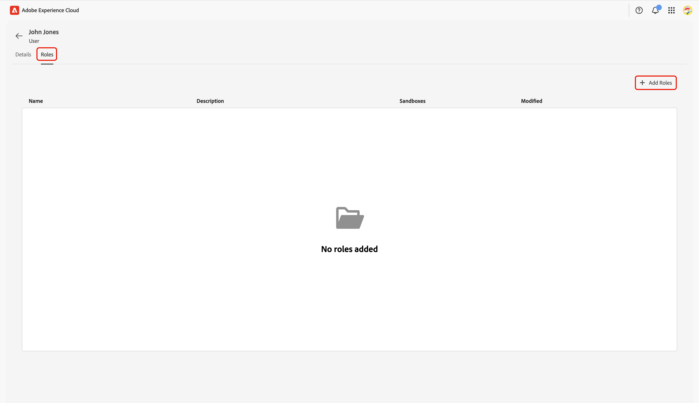
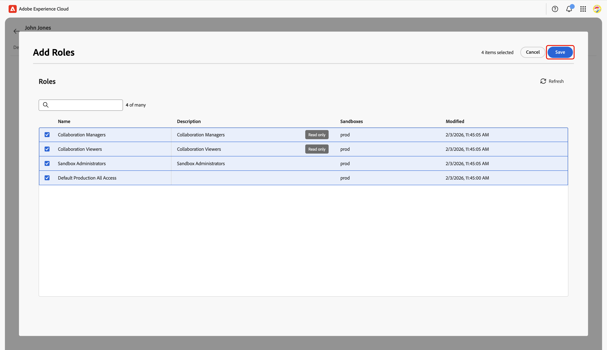

# Configura i controlli delle autorizzazioni per l&#39;onboarding di Collaboration [!DNL Starter]

Dopo aver impostato l’accesso amministratore e utente ai prodotti Adobe Experience Platform, devi assegnare a te stesso i ruoli con le autorizzazioni appropriate per Real-Time CDP Collaboration. Leggi questa guida per scoprire come aggiungere i ruoli giusti al tuo account tramite l’interfaccia Autorizzazioni di Experience Cloud, in modo da poter accedere e gestire l’accesso degli utenti alle funzioni di Collaboration.

Per informazioni dettagliate sui ruoli standard e sulle autorizzazioni disponibili inclusi nella risorsa Collaboration, consulta [guida alla gestione dei ruoli](../permissions/manage-roles.md).

## Prerequisiti {#prerequisites}

Assicurati di disporre sia di **privilegi di amministratore** che di **accesso utente** al prodotto Adobe Experience Platform. Se non hai già impostato questi livelli di accesso, consulta la [guida all&#39;accesso per gli amministratori](./starter-admin-access.md) per istruzioni dettagliate.

## Impostare le autorizzazioni {#setup-permissions}

Segui i passaggi seguenti per configurare le autorizzazioni necessarie per Collaboration. Accedi innanzitutto a [Adobe Experience Cloud](https://experience.adobe.com/) con le tue credenziali.

### Autorizzazioni di accesso {#access-permissions}

Dopo aver effettuato l&#39;accesso, passa alla sezione **[!UICONTROL Accesso rapido]** e seleziona **[!UICONTROL Autorizzazioni]**. Verrà aperto il dashboard Autorizzazioni, in cui è possibile assegnare i ruoli necessari.

{zoomable="yes"}

### Seleziona un utente {#select-user}

Nel dashboard **[!UICONTROL Autorizzazioni]**, seleziona **[!UICONTROL Utenti]** dal pannello a sinistra. Quindi seleziona il tuo account dalla tabella Utenti.

>[!NOTE]
>
> Se sei il primo utente della tua organizzazione ad accedere ad Experience Platform, potresti essere l&#39;unico utente elencato nella tabella **Utenti**. Per invitare altri membri del team, seguire i passaggi descritti nella [guida alla configurazione dell&#39;accesso utente](../permissions/manage-user-access.md#administrators-configure-user-access-to-experience-platform).

{zoomable="yes"}

### Assegna ruoli {#assign-roles}

Nell&#39;area di lavoro **[!UICONTROL Utente]** corrispondente, passa alla scheda **[!UICONTROL Ruoli]**. Quindi seleziona **[!UICONTROL Aggiungi ruoli]**.

{zoomable="yes"}

Viene visualizzata la finestra di dialogo **[!UICONTROL Aggiungi ruoli]** con una tabella dei ruoli disponibili. Ogni riga della tabella rappresenta un ruolo con le seguenti informazioni:

| **Colonna** | **Descrizione** |
|---------------|--------------------------------------------------------|
| **Nome** | Nome del ruolo. |
| **Descrizione** | Breve riepilogo che illustra la funzione del ruolo. I ruoli di sola lettura non possono essere personalizzati. |
| **Sandbox** | Specifica le sandbox (ad esempio, `Prod`) a cui il ruolo fornisce l&#39;accesso. |
| **Modificato** | Data dell&#39;ultimo aggiornamento del ruolo. |

{style="table-layout:auto"}

Per una panoramica approfondita di un ruolo specifico e delle relative autorizzazioni, vedere la [Guida alla gestione delle autorizzazioni per un ruolo](https://experienceleague.adobe.com/it/docs/experience-platform/access-control/abac/permissions-ui/permissions).

Rivedi le informazioni e seleziona i ruoli da assegnare al tuo account. Al termine, selezionare **[!UICONTROL Salva]**.

{zoomable="yes"}

Una finestra di dialogo di conferma conferma conferma che i nuovi ruoli sono stati aggiunti correttamente.

Per verificare che le autorizzazioni siano configurate correttamente, torna alla home page di [Experience Cloud](https://experience.adobe.com/). Seleziona **[!UICONTROL Real-Time CDP Collaboration]** in **[!UICONTROL Accesso rapido]**. Dovresti poter accedere all&#39;area di lavoro di Collaboration e iniziare a utilizzare le funzionalità disponibili per il tuo account [!DNL Starter].

## Passaggi successivi {#next-steps}

Una volta configurate le autorizzazioni, puoi accedere a Collaboration. Successivamente, è possibile:

* [Creare ruoli personalizzati con autorizzazioni specifiche per gestire diversi livelli di accesso](../permissions/manage-roles.md#create-specific-access-roles).
* [Assegnare più utenti a un ruolo nelle autorizzazioni](../permissions/manage-user-access.md#assign-a-role).
* [Configura l&#39;account Collaboration e stabilisci connessioni con il tuo collaboratore](../overview/starter-overview.md#set-up-connections).
* [Ulteriori informazioni sull&#39;utilizzo e il consumo del credito in Collaboration [!DNL Starter]](./starter-credit-usage.md).

Per una panoramica completa di Real-Time CDP Collaboration e delle sue funzionalità chiave, leggere la [guida alla panoramica](../home.md).
